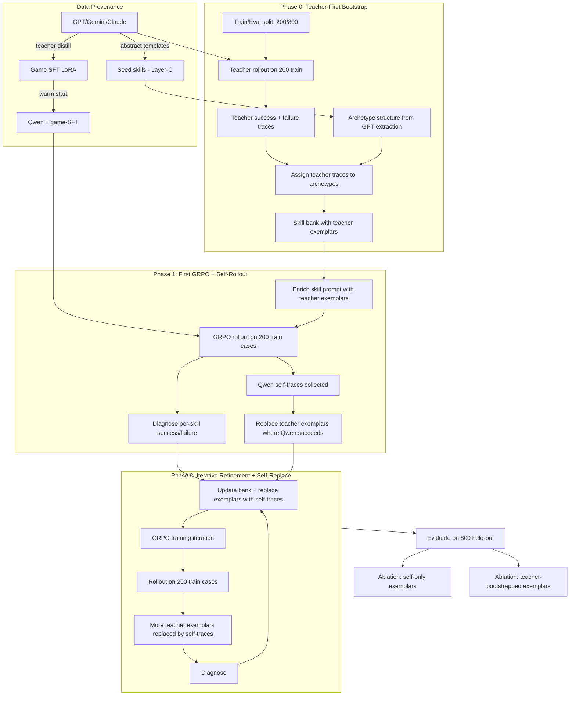

# Few-Shot Skill Bank Construction + Multi-Iteration Training Pipeline

## Data Provenance & Anti-Leakage Policy

All data used in training has clear provenance boundaries. This section
defines what can come from external teacher models (GPT-5.4, Claude,
Gemini, Qwen3-VL-235B) vs what must come from the target model itself.

### Games (12 tasks): Teacher distillation is safe

| Data | Source | Justification |
|------|--------|---------------|
| SFT data (action_taking, skill_selection) | GPT-5.4 + Claude + Gemini + Qwen3-VL | Standard teacher distillation. Games are interactive environments — no benchmark contamination risk. Teachers cannot "memorize" game trajectories. |
| Skill banks | GPT-5.4 extraction | Extracted from teacher rollouts. No static Q&A to leak. |
| GRPO rollouts | Qwen (self) | On-policy RL. Clean by definition. |

Games have 4 teachers, 2000-4000 trajectory steps, dense reward signals,
and bank-aligned SFT data. The standard pipeline (SFT warmup → GRPO) works
well. **No changes needed for games.**

### Non-game tasks (6 tasks): Teacher-first, then self-replace

| Data | Source | Phase | Status |
|------|--------|-------|--------|
| Seed skills (Layer-C templates) | GPT-5.4 | Bootstrap | ✅ Safe — abstract reasoning skeletons (`PERCEIVE → COMPARE → DECIDE`), contain no benchmark answers |
| Teacher demonstrations (train split) | GPT-5.4 / Gemini | Bootstrap | ✅ Safe — run teacher on train split only; used as initial ICL exemplars to cold-start the loop |
| SFT warmup (optional) | GPT-5.4 | Bootstrap | ✅ Safe if disclosed as distillation — teaches format & basic capability |
| ICL exemplars (iteration ≥1) | **Qwen (self)** | Training | ✅ Gradually replace teacher exemplars with Qwen's own traces as they become available |
| GRPO rollouts | Qwen (self) | Training | ✅ Clean by definition |

**Teacher-first strategy for non-game tasks:**

Cold-starting with Qwen self-rollout risks a dead loop: if Qwen's success
rate is near 0%, we have no positive exemplars, GRPO has no signal, and the
model cannot improve. Instead, we use **teacher demonstrations first**:

```
Phase 0 (Bootstrap):
  Teacher (GPT/Gemini) on 200 train samples
    → Teacher success traces (high quality, ~80-95% correct)
    → Build initial skill bank with teacher exemplars
    → [Optional] SFT warmup from teacher traces

Phase 1 (First GRPO iteration):
  Qwen rollout on 200 train → collect Qwen's own traces
    → Where Qwen succeeds: replace teacher exemplar with self-trace
    → Where Qwen fails: keep teacher exemplar as guidance
    → GRPO training with mixed exemplar bank

Phase 2+ (Iterative refinement):
  Each iteration, more teacher exemplars get replaced by self-traces
    → Qwen gets better → success rate rises → more self-traces available
    → Eventually: most/all exemplars are Qwen's own

Evaluation (800 held-out):
  Report both: (a) with teacher exemplars, (b) with self-only exemplars
  Transparent about which exemplars are used at evaluation time
```

**Why this is better than self-rollout-first:**
- Teacher demonstrations guarantee high-quality initial exemplars (no dead loop)
- Qwen sees *what good reasoning looks like* from iteration 1 (not iteration N)
- Gradual replacement means we converge to self-generated exemplars naturally
- If Qwen catches up to teacher quality, final bank is fully self-generated
- If Qwen plateaus below teacher, we still have a functioning system (with disclosed teacher exemplar use)

**Data provenance remains clean:**
- Teacher traces are on **train split only** (200 samples) → no eval leakage
- Teacher use is **disclosed** as "teacher-guided bootstrapping" in paper
- Ablation: report self-only vs teacher-bootstrapped to show genuine improvement
- Final eval can use self-only exemplars if reviewer concern is strong

**The pipeline for non-game tasks:**
```
GPT/Gemini (bootstrap):              Target model (replaces over time):
├─ Layer-C templates                  ├─ GRPO rollouts on train split
├─ Seed skill structures              ├─ Self-generated exemplars (replace teacher)
├─ Teacher demonstrations on train    └─ GRPO training data
└─ Optional SFT warmup
```

### Train / Eval split (mandatory for non-game tasks)

Each non-game task's samples must be split BEFORE any exemplar extraction:

```
Total ~1000 samples per task
├── 200 train split (fixed seed) → build skill bank, extract exemplars, GRPO training
└── 800 eval split              → evaluation only, never touched during training
```

Exemplars, skill bank statistics, and all training signals come exclusively
from the train split. The eval split is held out entirely.

---

## Motivation: What We Actually Learned from Cross-Task Analysis

### The naive story (wrong)

> "Mine skills from games, then transfer them to non-game tasks."

This does not hold. The Layer-B functional overlap matrix tells a different story:

|              | env_wr_game | gymv_game | vr_image | vr_video | web   |
| ------------ | :---------: | :-------: | :------: | :------: | :---: |
| env_wr_game  | **0.056**   | 0.035     | 0.024    | 0.024    | 0.030 |
| gymv_game    |             | **0.082** | 0.016    | 0.016    | 0.035 |
| vr_image     |             |           | **0.082**| 0.080    | 0.034 |
| vr_video     |             |           |          | **0.108**| 0.033 |
| web          |             |           |          |          | **0.073** |

Game-to-VR overlap is 0.016-0.024 (nearly zero). Game-to-web is 0.030-0.035
(also negligible). The strongest cross-task pairs are all **within cohort**:
siv_bench <-> video_holmes = 0.40, shooter games = 0.40, beat-em-ups = 0.39.

Concrete game skills (`move_left`, `rotate_cw`, `enemy_dispatched`) are
useless for VR QA or web interaction. Direct skill transfer across modalities
does not work at the functional level.

### The real story

What **does** transfer across all cohorts is the **Layer-C reasoning template
vocabulary** — the 8 abstract operators (PERCEIVE, RECALL, COMPARE, FILTER,
DECIDE, COMMIT, VERIFY, RECOVER) and the 2-5 step procedural templates built
from them. At Layer C, there are **1,719 cross-cohort skill pairs** sharing
the same reasoning signature (vs only 4 at Layer B). The template
`PERCEIVE -> COMPARE -> FILTER -> DECIDE` appears in candy_crush, tetris,
all 4 VR benchmarks, miniwob, and webshop — spanning every cohort.

The story is therefore:

> **From diverse tasks, distill a shared library of reasoning strategies
> (not concrete skills). When facing a new task with limited data (~200
> cases), match it to known reasoning templates, ground them with
> task-specific exemplars from the model's own rollouts, and use GRPO
> to teach the model to apply those strategies reliably.**

### What games actually contribute

Games are not the source of transferable *skills* — they are the source of
transferable *reasoning pattern discovery*:

- **Volume**: Each game has 2,000-4,000 trajectory steps (vs ~200 cases for
  non-game tasks). This volume lets us reliably extract and validate Layer-C
  templates. With only 200 cases, template quality would be much lower.
- **Diversity**: 12 games with different mechanics produce a broad vocabulary
  of reasoning patterns. Some patterns (PERCEIVE -> COMPARE -> DECIDE) turn
  out to be universal; others (COMMIT -> RECOVER -> COMMIT) are game-specific.
  The filtering happens automatically via plan-level judge clustering.
- **Validation**: Game trajectories have dense reward signals, so we can
  verify which reasoning templates actually lead to successful outcomes.
- **SFT data**: Games provide high-quality bank-aligned SFT data from 4
  teacher models (GPT-5.4, Claude-4.6, Gemini-3.1, Qwen3-VL-235B). This is
  safe because game environments are interactive — no static benchmark to
  memorize. The SFT pipeline warms up the base model before non-game
  adaptation begins.

### What non-game tasks contribute to each other

The real actionable transfer is **within cohort**:

- **VR benchmarks** (video_holmes, siv_bench, tir_bench, visual_toolbench):
  Form the densest transfer graph (J_tok 0.29-0.40). An exemplar from
  siv_bench's `COMPARE/ANSWER` skill directly helps video_holmes because
  both do "option evidence matching" — same cognitive procedure, different
  video content.
- **Web tasks** (miniwob, webshop): Share interaction patterns (navigate,
  fill form, select product) though webshop is much longer-horizon.

This within-cohort transfer is what the exemplar-sharing mechanism in this
plan exploits: when visual_toolbench has only 31 members, it borrows
exemplars from tir_bench (same cohort, same reasoning signatures).

---

## Problem Statement

Current pipeline produces abstract archetype skills for all 6 non-game tasks but none are actionable:

| Task | Skills | Members | Modality | Exemplar source |
|------|--------|---------|----------|-----------------|
| video_holmes | 7 | 396 | video QA | ~200 cases, 46-74 members per cluster |
| siv_bench | 10 | 220 | video QA | ~200 cases, 18-27 members per cluster |
| tir_bench | 11 | 105 | image QA | ~100 cases, 7-16 members per cluster |
| visual_toolbench | 2 | 31 | image QA | ~30 cases, 12-19 members per cluster |
| miniwob | 45 | 125 | web | ~125 cases, mostly 1 member per skill |
| webshop | 3 | 50 | web | ~50 cases, 12-25 members per cluster |

Common problems across all 6:
- Agent only sees abstract step descriptions, never concrete examples
- `sub_episodes` is empty for all non-game tasks; `protocol_raw` has per-sample reasoning but is never exposed
- Skill bank is static after extraction; no update mechanism between training iterations
- `action_taking.jsonl` uses synthetic skill IDs mismatched with bank-derived `skill_selection.jsonl` — existing SFT data is noisy, not worth training on

**Critical issue — skills are currently prompts, not verified reasoning steps:**

ALL 406 skills across all tasks have **empty `step_checks`** (`["", "", "", "", ""]`).
The Layer-C template lift (`inject_layerc_protocols.py`) generates protocol steps
but the `template_steps` carry no `effects_add`, so `step_checks` are all empty.

When `step_checks` are empty, `compute_step_advancement()` falls back to
auto-advancing every step. The +0.1 intrinsic bonus per step fires **regardless**
of whether the model actually performed that reasoning step. The 5-step protocol
gives a free +0.5 bonus to every episode, which dilutes GRPO's reward signal.

Per-sample skills from `single_shot_lift.py` **do** have meaningful `effects_add`
(`answer_emitted`, `answer_matches_gold`, `entity_grounded`), but these are
stored in the skill `contract` — they never reach `protocol.step_checks`.

**This plan must fix this.** See Phase 0e below.

Key structural difference: VR tasks (video_holmes/siv_bench/tir_bench/visual_toolbench) are `single_shot_qa` with decent cluster sizes (7-74 members). Web tasks (miniwob/webshop) are `MINED` with miniwob having 45 very small clusters (often 1 member each).

### How skills work differently across task types

Skills are **not** just prompt text. The training loop uses them as:

```
Skill protocol steps       → prompt guidance (what to reason about)
                           + step_checks (state predicates to verify reasoning)
                           + intrinsic_bonus (+0.1 per verified step, +0.3 on success)
                           + GRPO reward shaping (env_reward + intrinsic + 1.0)
```

| Task type | Steps | Reward | Step verification |
|---|---|---|---|
| **Games** (interactive) | Multi-turn: each step = 1 env action | Dense (score per step) | Should use state predicates, currently empty |
| **VR QA** (single-shot) | Single-turn: all steps = 1 reasoning chain | Binary (correct/incorrect) | Should verify reasoning chain structure, currently empty |
| **Web** (sequential) | Multi-turn: each step = 1 browser action | Sparse (task completion) | Should use DOM state, currently empty |

For non-game QA specifically:
- The 5-step protocol (`PERCEIVE → COMPARE → FILTER → DECIDE → VERIFY`) describes the **internal reasoning chain**, not separate environment interactions
- The model produces all 5 reasoning steps in a **single turn** (one `answer_reasoning` output)
- Step verification must check whether the model's reasoning OUTPUT follows the protocol structure
- The per-sample `effects_add` already capture this: `entity_grounded` means PERCEIVE happened, `answer_emitted` means DECIDE/COMMIT happened

## Architecture: 3-Phase Closed Loop (Teacher-First Bootstrap)



### Training path: Games vs Non-Game

**Games (12 tasks) — standard SFT + GRPO, no changes needed:**

```
Multi-teacher rollouts (GPT-5.4 / Claude / Gemini / Qwen3-VL-235B)
  → SFT on action_taking + skill_selection (bank-aligned, 4 teachers)
  → GRPO with game-specific skill bank
  → Phase 1 (6 source games) → Phase 2 (6 hold-out games)
```

Teacher distillation is safe for games because:
- Games are interactive environments, not static benchmarks
- No model can "memorize" the correct action at frame N of Thunder Force III
- 4-teacher ensemble provides diversity and reduces single-model bias
- Dense reward signals (score/lives) enable direct RL optimization

**Non-game tasks (6 tasks) — teacher-bootstrapped exemplar GRPO:**

```
Recommended pipeline:
  Game-SFT'd Qwen
    → Teacher demonstration on 200 train (GPT/Gemini, one-time)
    → Build initial skill bank with teacher exemplars
    → GRPO iteration 1 (teacher exemplars in prompt)
    → Collect Qwen self-traces → replace teacher exemplars where Qwen succeeds
    → GRPO iteration 2+ (mixed → gradually self-only exemplars)
    → Evaluate on 800 held-out
```

**Why teacher-first, not self-first:**

- **Eliminates cold-start failure**: If Qwen has 0% success rate on a new task,
  self-rollout-first gives no positive exemplars, no GRPO signal, no improvement.
  Teacher-first always provides high-quality demonstrations to bootstrap from.
- **Qwen sees good reasoning from day 1**: Teacher exemplars show what correct
  multi-step reasoning looks like for the target task. This is far more effective
  than abstract skill descriptions alone.
- **Natural curriculum**: Teacher exemplars → mixed → self-only. As Qwen improves,
  it generates its own traces that replace teacher ones. The bank converges to
  self-generated data without any hard cutoff.
- **Handles varying difficulty**: Easy tasks: Qwen self-traces replace teacher
  quickly (iteration 1-2). Hard tasks: teacher exemplars persist longer, providing
  continued guidance until Qwen catches up.

**Teacher demonstration is a one-time cost:**

- Run GPT/Gemini on 200 train samples once → store traces
- No repeated teacher calls during GRPO iterations
- Cost: ~200 API calls per task × 6 tasks = 1,200 total calls (negligible)

**Game-SFT still provides the warm start:**

- Game SFT teaches format compliance and multi-step reasoning habits
- Game SFT LoRA does NOT teach non-game benchmark answers
- Combined with teacher exemplars: the model has both general reasoning ability
  (from games) and task-specific guidance (from teacher demonstrations)

**Task-specific non-game SFT remains optional:**

- Teacher demonstrations in prompts (ICL) are more sample-efficient than SFT
- 200 cases are too few for task-specific SFT (overfitting risk)
- Existing non-game SFT data has quality issues (action_taking.jsonl has
  synthetic skill ID mismatch with bank-derived skill_selection.jsonl)
- If desired: can use teacher traces for SFT → must disclose as distillation

---

## Phase 0: Skill Bank Bootstrap (from 200 cases)

### Step 0-pre: Train/Eval split

Before any exemplar work, split each non-game task into train/eval:

```bash
python scripts/split_train_eval.py \
    --cold-start-root $DOWNLOAD_ROOT/Cold-start-out-visual-reasoning-video \
    --tasks video_holmes siv_bench \
    --train-size 200 --seed 42 \
    --output-dir frontier_data/output/splits/
```

Output: `splits/<task>/train_ids.json` and `splits/<task>/eval_ids.json`.
All subsequent steps in Phase 0-2 use ONLY train IDs.

### Step 0a: Teacher demonstration on train split (one-time bootstrap)

Run **teacher model** (GPT-5.4 / Gemini) on the 200 train samples to collect
high-quality demonstrations. This is a one-time cost before GRPO begins:

```bash
python scripts/collect_teacher_demonstrations.py \
    --teacher gpt-5.4 \
    --task video_holmes \
    --sample-ids frontier_data/output/splits/video_holmes/train_ids.json \
    --output-dir frontier_data/output/teacher_demos/video_holmes/
```

Each output record contains:
- `question`, `schema` (from the benchmark)
- `teacher_reasoning` (teacher's reasoning trace)
- `teacher_answer`, `gold_answer`, `correct` (bool)
- `source_model` (e.g. "gpt-5.4") — provenance tracking

Expected outcome for ~200 samples:
- ~160-190 correct (80-95% teacher accuracy)
- ~10-40 incorrect (teacher failures — useful as negative examples)

**These teacher traces serve as INITIAL exemplars.** They will be gradually
replaced by Qwen's own self-traces as GRPO iterations progress.

### Step 0a-self: Qwen self-rollout on train split (collected during GRPO)

During each GRPO iteration, Qwen's own rollout traces on the 200 train
samples are collected automatically. After each iteration:

```python
def collect_self_traces(rollout_episodes, train_ids):
    """Extract Qwen's reasoning traces from GRPO rollout episodes."""
    traces = []
    for ep in rollout_episodes:
        if ep.sample_id in train_ids:
            traces.append({
                "question": ep.question,
                "model_reasoning": ep.answer_reasoning,
                "model_answer": ep.predicted_answer,
                "gold_answer": ep.gold_answer,
                "correct": ep.reward > 0,
                "source_model": "qwen-self",
                "iteration": ep.iteration,
            })
    return traces
```

**Exemplar replacement rule** (applied after each GRPO iteration):

```python
def maybe_replace_exemplar(skill, qwen_trace, current_exemplar):
    """Replace teacher exemplar with Qwen self-trace when quality is sufficient."""
    if qwen_trace["source_model"] != "qwen-self":
        return current_exemplar  # safety check

    if current_exemplar["source_model"] == "qwen-self":
        # Already self-generated; only replace if strictly better
        if is_better_exemplar(qwen_trace, current_exemplar):
            return qwen_trace
        return current_exemplar

    # Current exemplar is from teacher — replace if Qwen's trace is valid
    if is_valid_exemplar(qwen_trace, kind="success"):
        return qwen_trace  # teacher → self replacement

    return current_exemplar  # keep teacher until Qwen produces valid trace
```

**Expected convergence:**

| Iteration | Teacher exemplars | Self exemplars | Total |
|-----------|:-----------------:|:--------------:|:-----:|
| 0 (bootstrap) | 100% | 0% | — |
| 1 | ~60-70% | ~30-40% | — |
| 2 | ~30-40% | ~60-70% | — |
| 3+ | ~10-20% | ~80-90% | — |
| Final (hard tasks) | 5-20% | 80-95% | — |

For easy tasks, Qwen replaces teacher exemplars quickly (iteration 1-2).
For hard tasks where Qwen struggles, teacher exemplars persist — this is
**by design**, as they continue to provide guidance where the model needs it most.

### Step 0b: Assign teacher demonstrations to archetypes

The archetype structure (cluster names, Layer-C templates) comes from the
GPT-extracted skill bank — this is safe because archetypes are abstract
reasoning skeletons without specific answers.

For each archetype, assign teacher demonstration traces by matching:
1. `task_id` in teacher demo → `member_skill_ids` in archetype provenance
2. For cases that don't match existing members, assign by closest
   `template_signature` match

Then select per-archetype exemplars from teacher traces:
- **1 success exemplar**: Pick the clearest correct reasoning trace
- **1 failure exemplar**: Pick the most informative wrong reasoning trace (from
  teacher failures or cases where teacher reasoning was correct but convoluted)

Selection criteria:
- Success: shortest reasoning chain that reaches correct answer (clearest signal)
- Failure: reasoning that is plausible but wrong (most instructive mistake)

### Per-task exemplar availability (estimated, teacher-bootstrapped)

| Task | Train samples | Teacher success | Teacher failure | Archetypes |
|------|:------------:|:---------------:|:---------------:|:----------:|
| video_holmes | 200 | ~170 (85%) | ~30 | 7 |
| siv_bench | 200 | ~160 (80%) | ~40 | 10 |
| tir_bench | 100 | ~85 (85%) | ~15 | 11 |
| visual_toolbench | 30 | ~25 (83%) | ~5 | 2 |
| miniwob | 125 | ~110 (88%) | ~15 | 45 |
| webshop | 50 | ~40 (80%) | ~10 | 3 |

**Key advantage over self-rollout-first**: Every archetype is guaranteed to
have multiple high-quality exemplars, even for hard tasks where Qwen's
baseline success rate would be near zero.

For tasks with few train samples (visual_toolbench, webshop), augment with
cross-task exemplars from same cohort (see Cross-Task Exemplar Sharing below).

### Step 0c: Seed skill construction — assembly, not generation

**Principle**: seed skills are assembled from existing components, never
LLM-generated. The old `bind_abstract_to_task.py` called GPT-5.4 to
generate full `BoundConcreteSkill` JSON (protocol, contract, effects).
This is replaced by deterministic assembly.

**Two paths depending on task status:**

```
Existing non-game task (6 tasks, already have archetypes):
  protocol.steps    ← archetype's existing steps (already domain-specific)
  exemplars         ← protocol_raw.steps (per-sample reasoning trace)
  step_checks       ← Phase 0e deterministic fill
  contract          ← archetype's existing effects

New task (future, no archetypes):
  protocol.steps    ← mega-skill template_steps[].predicate (abstract but serviceable)
  exemplars         ← teacher demonstrations on train split
  step_checks       ← Phase 0e deterministic fill from template_signature operators
  contract          ← mega-skill protocol_steps[].effects (type-level)
```

In both cases: **exemplar does the domain adaptation, not step description**.
The model learns what "Identify key evidence" means concretely from the
exemplar trace, not from the step description text.

**Zero LLM calls.** All components are either pre-existing data or
deterministic mappings.

### Step 0c-gate: Anti-leakage gate for protocol_raw exemplars

**Risk**: the existing skill bank's `protocol_raw` was extracted from the
FULL dataset (before train/eval split). Each archetype's representative
sample might fall in the eval split. Using it as an exemplar during
training would leak eval answers.

**Gate**: before any `protocol_raw` enters as an exemplar, verify its
source sample is in the train split:

```python
def select_safe_exemplar(archetype, train_ids, teacher_demos=None):
    """Select exemplar that is guaranteed to be from train split."""
    rep_id = archetype["report"]["lift_stats"]["representative_skill_id"]
    
    if rep_id in train_ids:
        return archetype["skill"]["protocol_raw"]  # safe
    
    # Representative is in eval split — find alternative from same archetype
    for member_id in get_archetype_members(archetype):
        if member_id in train_ids:
            member_raw = load_member_protocol_raw(member_id)
            if member_raw and member_raw.get("steps"):
                return member_raw
    
    # No archetype member in train split — fall back to teacher demo
    if teacher_demos:
        return teacher_demos.get_best_trace(archetype["skill"]["skill_id"])
    
    return None  # no safe exemplar available
```

**Rule: any data entering an exemplar field MUST come from train split.**
This applies to both `protocol_raw` (GPT extraction) and teacher demos
(Phase 0a already enforces this by only running on train samples).

### Step 0d: Merge and produce initial bank

Output format: standard `skill_bank.jsonl` compatible with `SkillBankMVP.load()`, but each skill now carries:
- `protocol.steps` (from Layer-C template)
- `protocol.step_checks` (populated from effects_add — see Step 0e)
- `exemplars` (1-2 teacher demonstration traces, tagged with `source_model`)
- `failure_exemplars` (0-1 teacher failure patterns, tagged with `source_model`)
- `protocol_raw` (full per-sample reasoning for the representative case)
- `exemplar_source` tracking: `"teacher"` initially, flips to `"self"` after replacement

Each exemplar record includes a `source_model` field (`"gpt-5.4"`, `"gemini"`,
or `"qwen-self"`) so the bank always knows provenance. The Phase 2 update loop
prioritizes replacing `source_model != "qwen-self"` exemplars with Qwen's own
traces whenever a valid self-trace is available.

### Step 0e: Populate step_checks from per-sample effects (CRITICAL)

**Problem**: All 406 skills have empty `step_checks`. Without checks,
`compute_step_advancement()` auto-advances and intrinsic bonus is free.
Skills become prompts, not verified reasoning steps.

**Solution**: Map per-sample `effects_add` (from `single_shot_lift.py`)
back to protocol step positions. Each Layer-C operator has a natural
mapping to verifiable effects:

```python
# Mapping: Layer-C operator → effects_add type that verifies it
OPERATOR_TO_EFFECT = {
    "PERCEIVE": "entity_grounded",       # did model cite schema entities?
    "RECALL":   "entity_grounded",       # did model reference prior knowledge?
    "COMPARE":  "options_compared",      # did model compare multiple options?
    "FILTER":   "candidates_eliminated", # did model eliminate options?
    "DECIDE":   "answer_selected",       # did model select an answer?
    "COMMIT":   "answer_emitted",        # did model emit final answer?
    "VERIFY":   "answer_matches_gold",   # (only at training time, not inference)
}
```

**For VR QA tasks** (single-turn reasoning), step_checks verify the
model's reasoning OUTPUT, not environment state:

```python
def build_qa_step_checks(protocol_steps, template_signature):
    """Build step_checks that verify reasoning chain structure.

    For single-shot QA, all steps happen in one model output.
    Step checks are evaluated against the model's answer_reasoning text,
    parsed into a lightweight state dict by the episode runner.
    """
    checks = []
    for i, (step, op) in enumerate(zip(protocol_steps, template_signature.split(" → "))):
        op = op.strip()
        if op in ("PERCEIVE", "RECALL"):
            # Verify model cited at least one entity from schema
            checks.append("entity_refs_count>=1")
        elif op in ("COMPARE", "FILTER"):
            # Verify model mentioned comparison/elimination language
            checks.append("reasoning_has_comparison=true")
        elif op in ("DECIDE", "COMMIT"):
            # Verify model selected an answer
            checks.append("answer_emitted=true")
        elif op == "VERIFY":
            # Verify model expressed confidence/confirmation
            checks.append("answer_confirmed=true")
        else:
            checks.append("")  # no check for unknown ops
    return checks
```

**For web tasks** (multi-turn), step_checks verify DOM state:

```python
def build_web_step_checks(protocol_steps, template_signature):
    checks = []
    for op in template_signature.split(" → "):
        op = op.strip()
        if op == "PERCEIVE":
            checks.append("page_loaded=true")
        elif op == "NAVIGATE":
            checks.append("url_changed=true")
        elif op in ("DECIDE", "COMMIT"):
            checks.append("action_executed=true")
        elif op == "VERIFY":
            checks.append("task_completed=true")
        else:
            checks.append("")
    return checks
```

**Episode runner integration**: The episode runner needs to parse the model's
reasoning output and build a state dict that these checks can evaluate against.
For VR QA, `parse_reasoning_state()` extracts:
- `entity_refs_count`: count of `e\d+` patterns in reasoning text
- `reasoning_has_comparison`: presence of comparison keywords
- `answer_emitted`: whether a final answer was stated
- `answer_confirmed`: whether verification language was used

This state dict feeds into `compute_step_advancement()`, which then only
grants +0.1 intrinsic bonus when the check ACTUALLY passes.

**Impact**: With real step_checks:
- Intrinsic bonus is earned, not free: model must demonstrate each reasoning step
- GRPO reward is meaningful: env_reward (correct/incorrect) + intrinsic (did you follow the reasoning structure?)
- Stall detection becomes precise: "stalled at step 3 [DECIDE]" means the model perceived and compared but couldn't select an answer
- Phase 2 bottleneck analysis has real signal, not noise

---

## Phase 1: Enriched Prompt Injection (replaces SFT)

### Step 1a: Modify `_format_skill_guidance_for_prompt()`

**File**: `trainer/coevolution/episode_runner.py` lines 483-512

Current output is ~8 lines. New output adds exemplars (~15 lines total):

```
--- Active Skill: Core Theme Inference (CTI) ---
  Framework: PERCEIVE -> COMPARE -> FILTER -> DECIDE -> VERIFY
  Plan (5 steps):
     1. Identify evidence anchors in the video
     2. Assess which thematic interpretation fits all cues
     3. Eliminate unsupported themes
  >> 4. Select the most likely core theme                     ← current step
     5. Verify against central evidence pattern

  ⚠ Step 4 [DECIDE] is the most common failure point (stall rate 73%).
    Typical mistake: choosing theme based on single prop instead of causal chain.

  Example (correct):
    Q: "What is the core theme?"
    Key evidence: message="Weird things since the challenge" + smartphone + cartoon mouse
    Reasoning: Message links horror to game participation -> dangerous novelty games -> (C)

  Counter-example (wrong):
    Mistake: Focused on smartphone prop -> guessed "technology dependence"
    Lesson: Trace causal chains in dialogue, don't fixate on individual props

  Done when: answer_emitted
  Abort if: No progress after several moves
--- end skill ---
```

The prompt now includes:
- **Step progress markers** (`>>` on current step) from `SkillTracker.protocol_step`
- **Bottleneck warning** (⚠) when `bank_updater` has identified a high-stall step
- **Success exemplar** — initially from teacher (iteration 0), replaced by Qwen self-trace as available
- **Failure exemplar** — initially from teacher, replaced by Qwen self-trace as available

The bottleneck warning is only shown when `SkillDiagnosis.bottleneck_step`
is set (i.e., after at least one iteration of rollout data). First iteration
shows teacher exemplars only, no bottleneck info.

**Exemplar rendering does NOT distinguish source in the prompt.** The model
sees the same format regardless of whether the exemplar is from teacher or
self. The `source_model` tag is metadata for bank management, not for the
model's eyes. This prevents the model from treating teacher vs self exemplars
differently.

Token budget: ~250 tokens per skill block (up from ~80). Acceptable within 35B's 32K context.

### Step 1b: Modify `to_decision_agent_view()`

**File**: `skill_agents/stage3_mvp/schemas.py` line 656

Add `exemplars` and `failure_exemplars` to the view dict so `SkillBankProvider._enrich_from_skill()` can pass them through to `SkillGuidance`.

### Step 1c: Extend `SkillGuidance` dataclass

**File**: `decision_agents/skill_interface.py` line 43

Add two fields:
- `exemplars: List[Dict[str, str]]` (each has `question`, `evidence`, `reasoning`, `answer`)
- `failure_exemplars: List[Dict[str, str]]` (each has `mistake`, `lesson`)

Also expose `failure_modes` in the prompt (currently stored but never rendered).

---

## Phase 2: Multi-Iteration Bank Update (Statistics-Only, No LLM Calls)

### Why zero LLM calls in the update loop

Crafter v2 used online LLM calls (35B) to HYPOTHESIZE new skills and PATCH
existing ones. This caused three documented problems:

1. **Skill pollution**: 230/230 crafter-promoted skills had a single
   `[EXEC] hypothesis` step — the LLM's actual proposed protocol was lost
   at the serialization seam. The bank filled with degenerate 1-step skills.
2. **Mode collapse**: The LLM proposer kept generating the same 3-4 skill
   templates regardless of failure context, because the prompt lacked
   enough episode-specific grounding.
3. **Quality unpredictability**: LLM-generated skills had no quality
   guarantee — some were incoherent, some contradicted game mechanics,
   some duplicated existing skills with slightly different wording.

**Our replacement:** every bank update decision is computed from rollout
statistics. The only things that enter the bank are:
- **Exemplars** from actual rollout episodes (real data, not LLM-generated)
- **Skills** from the pre-computed mega-skill library (vetted offline)
- **Statistical annotations** (success_rate, stall_step, failure_count)

No LLM is called during bank updates. No new skill text is generated online.

### Step 2a: Per-skill + per-step outcome tracking

**File**: `trainer/coevolution/bank_updater.py` (new)

After each iteration's rollouts, compute:

```python
@dataclass
class SkillDiagnosis:
    skill_id: str
    n_episodes: int
    success_rate: float          # correct / total
    per_step_stall_rate: Dict[int, float]  # step_idx → fraction of episodes that stalled here
    bottleneck_step: Optional[int]         # step with highest stall rate (if > 50%)
    best_success_trace: Optional[Dict]     # clearest successful reasoning
    most_instructive_failure: Optional[Dict] # most common failure pattern
    cumulative_iterations_below_threshold: int  # consecutive iterations with success < 20%
```

**Per-step stall tracking** uses data already in `SkillTracker`:
- `protocol_step` at termination tells us how far the agent got
- `last_outcome` tells us why it stopped ("stall", "abort_matched", "success_matched", etc.)
- Aggregate across episodes: "step 3 [DECIDE] was the termination point in 73% of failures"

This is pure counting over rollout metadata — zero LLM calls.

### Step 2b: Bank update rules (all deterministic)

```python
def update_bank_from_rollouts(diagnoses: List[SkillDiagnosis], bank, config):
    for d in diagnoses:
        # ── Quality gate: minimum evidence ──
        if d.n_episodes < config.min_episodes_for_decision:  # default: 5
            continue  # not enough data to make any decision

        # ── TEACHER→SELF REPLACEMENT (priority, runs every iteration) ──
        # Always try to replace teacher exemplars with valid self-traces
        current_exemplar = bank.get_exemplar(d.skill_id)
        if current_exemplar and current_exemplar.get("source_model") != "qwen-self":
            if d.best_success_trace and is_valid_exemplar(d.best_success_trace, "success"):
                bank.replace_exemplar(d.skill_id, d.best_success_trace)
                # Trace already tagged source_model="qwen-self" by collector

        current_fail = bank.get_failure_exemplar(d.skill_id)
        if current_fail and current_fail.get("source_model") != "qwen-self":
            if d.most_instructive_failure and is_valid_exemplar(d.most_instructive_failure, "failure"):
                bank.replace_failure_exemplar(d.skill_id, d.most_instructive_failure)

        # ── ENRICH: skill is working well, upgrade self-exemplar ──
        if d.success_rate >= config.enrich_threshold:  # default: 0.50
            if d.best_success_trace is not None:
                bank.replace_exemplar(d.skill_id, d.best_success_trace)

        # ── ANNOTATE BOTTLENECK: skill has a specific weak step ──
        if d.bottleneck_step is not None and d.per_step_stall_rate[d.bottleneck_step] > 0.50:
            bank.annotate_bottleneck(d.skill_id, d.bottleneck_step,
                stall_rate=d.per_step_stall_rate[d.bottleneck_step])
            if d.most_instructive_failure is not None:
                bank.replace_failure_exemplar(d.skill_id, d.most_instructive_failure,
                    bottleneck_step=d.bottleneck_step)

        # ── DEMOTE: consistently failing ──
        if d.cumulative_iterations_below_threshold >= config.retire_after_n_bad_iters:  # default: 2
            bank.retire_skill(d.skill_id)
            # Also propagate failure back to shared bank (Step 2d)

        # ── REFRESH FAILURE EXEMPLAR: mixed results ──
        elif config.demote_threshold < d.success_rate < config.enrich_threshold:
            if d.most_instructive_failure is not None:
                bank.replace_failure_exemplar(d.skill_id, d.most_instructive_failure)
```

### Step 2c: Exemplar quality gates

Not all rollout traces are good exemplars. Before any trace enters the bank:

```python
def is_valid_exemplar(trace: Dict, kind: str) -> bool:
    reasoning = trace.get("model_reasoning", "")

    # Gate 1: non-empty and non-truncated
    if len(reasoning) < 20 or reasoning.endswith("..."):
        return False

    # Gate 2: contains actual reasoning steps (not just "I think the answer is X")
    reasoning_indicators = ["because", "evidence", "since", "therefore",
                           "compare", "observe", "notice"]
    if not any(w in reasoning.lower() for w in reasoning_indicators):
        return False

    # Gate 3: for success exemplars, answer must be correct
    if kind == "success" and not trace.get("correct", False):
        return False

    # Gate 4: for failure exemplars, must have a clear wrong reasoning
    # (not just "I don't know" or empty reasoning)
    if kind == "failure" and trace.get("correct", True):
        return False

    return True
```

### Step 2d: Failure feedback to shared bank (bookkeeping, no LLM)

When a skill is retired in per-task bank, propagate to the shared bank:

```python
def propagate_retirement_to_shared_bank(skill_id, task, failure_summary, shared_bank):
    # Find the mega-skill this per-task skill was seeded from
    mega_skill_id = bank.get_mega_skill_lineage(skill_id)
    if mega_skill_id is None:
        return

    # Annotate the mega-skill (append, don't overwrite)
    shared_bank.add_failure_decoration(mega_skill_id, {
        "task": task,
        "failure_step": failure_summary.bottleneck_step,
        "stall_rate": failure_summary.per_step_stall_rate,
        "success_rate": failure_summary.success_rate,
        "n_episodes": failure_summary.n_episodes,
        "retired_at_iteration": current_iteration,
    })
```

This serves two purposes:
1. **Prevent re-seeding**: `seed_per_task_bank_cold_start.py` checks
   `failure_decorations` before selecting mega-skills. If a mega-skill
   failed on `video_holmes`, it gets down-weighted for `siv_bench`
   (same cohort → likely same failure mode).
2. **Cross-task learning**: Over multiple tasks, patterns emerge — e.g.
   "NAVIGATE_AND_REACH mega-skills consistently fail on VR tasks" →
   this informs the Layer-C template analysis.

### Step 2e: Failure-driven mega-skill lookup (table lookup, no LLM)

When a skill bottlenecks at a specific step, check if the pre-computed
mega-skill library has an alternative approach for that step type:

```python
def find_alternative_megaskill(bottleneck_step_op, task, shared_bank, judge_scores):
    """
    Use PRE-COMPUTED plan-level judge scores (already in
    plan_level_similarity_judgments.json) to find mega-skills that
    cover the bottleneck operation differently.

    This is a table lookup, NOT an LLM call.
    """
    current_signature = bank.get_template_signature(skill_id)
    bottleneck_op = current_signature.steps[bottleneck_step_op]  # e.g. "DECIDE"

    candidates = []
    for mega_skill in shared_bank.all():
        # Skip if already tried and failed on this task
        if task in mega_skill.failure_decorations:
            continue

        # Must have a different approach to the bottleneck operation
        mega_sig = mega_skill.template_signature
        if mega_sig == current_signature:
            continue  # same approach, would fail the same way

        # Must have pre-computed judge score ≥ 4 with current skill's domain
        pair_key = (mega_skill.id, current_skill_archetype)
        if judge_scores.get(pair_key, 0) < 4:
            continue

        # Must have proven success in at least one other task
        if mega_skill.success_decorations_count == 0:
            continue

        candidates.append(mega_skill)

    # Return top candidate by cross-task success rate, or None
    if not candidates:
        return None
    return max(candidates, key=lambda m: m.cross_task_success_rate)
```

This is safe because:
- Uses only **pre-computed** judge scores (offline, already in JSON files)
- Only selects mega-skills that have **proven success** in other tasks
- Skips mega-skills that **already failed** on the same or similar tasks
- **No new skill text is generated** — the mega-skill's existing template
  is used as-is, with new exemplars from self-rollout

### Step 2f: Integration with co-evolution orchestrator

**File**: `trainer/coevolution/orchestrator.py`

```
for iteration in range(n_iterations):
    1. rollout(200 train cases, current bank) → episodes
    2. GRPO update on episodes
    3. diagnose_skill_performance(episodes) → per-skill + per-step stats
    4. update_bank:
       a. enrich / annotate / demote / retire (statistics-driven)
       b. propagate retirements to shared bank (bookkeeping)
       c. if any skill retired AND bottleneck identified:
          lookup alternative mega-skill (table lookup, no LLM)
          → inject as new seed with template + cross-task exemplar
    5. quality_check: validate all new/updated exemplars pass gates
    6. reload_bank_from_disk() → next iteration sees updated bank
```

### Comparison: Crafter v2 vs New Statistics-Driven Approach

| Aspect | Crafter v2 (old) | Statistics-driven (new) |
|---|---|---|
| **New skill generation** | LLM HYPOTHESIZE → 1-step degenerate skills | No new text generated; only inject vetted mega-skills from library |
| **Skill modification** | LLM PATCH → unpredictable mutations | Replace exemplar with actual rollout trace (real data) |
| **Failure detection** | Episode-level buckets (USELESS_ACTION, ZERO_REWARD...) | Per-step stall tracking (which step, how often) |
| **Quality control** | Gate decisions on LLM-generated proposals | Quality gates on real rollout data; minimum episode thresholds |
| **Online LLM calls** | 35B call per failure trace | **Zero** |
| **Shared bank feedback** | None | Failure decorations prevent re-seeding bad mega-skills |
| **New skill source** | LLM imagination | Pre-computed mega-skill library (vetted offline) |

---

## Online Component Architecture: What to Keep, What to Disable

The co-evolution training loop has three online subsystems: **Harness**,
**Crafter**, and **Promotion**. Each has both a deterministic (CPU-only)
path and an LLM-driven path. The key insight: **only the Crafter LLM path
actually failed.** Harness and Promotion are architecturally sound — they
were disabled as collateral when the Crafter was turned off, not because
of their own defects.

### Component-by-component analysis

| Component | Sub-path | LLM? | Status | Decision | Rationale |
|-----------|----------|:----:|--------|----------|-----------|
| **Harness core** (eligibility filter) | F1 status / F2 domain / F2' task / F3 adapter / F4 can_handle | ❌ CPU | Was disabled | **Re-enable** | Pure deterministic filtering, microsecond-level, prevents wrong skills from being selected |
| **Harness validate_invocation** | Check model followed skill protocol | ❌ CPU | Was disabled | **Re-enable** | Tracks whether model actually used the skill — essential for honest statistics |
| **Harness rejection sink** | Record which skills get rejected | ❌ CPU | Was disabled | **Re-enable** | Feeds data to `bank_updater` for retire decisions |
| **Harness LLM validator** | 35B validates skill execution | ✅ 35B | Was disabled | **Keep disabled** | Marginal value over deterministic validation, high cost |
| **Crafter rule-based retire** | OUTCOME_FAILURE → RetireProposal | ❌ Rules | Was disabled | **Re-enable** | Episode-level failure detection complements `bank_updater`'s per-step stall tracking |
| **Crafter LLM hypothesize/patch** | 35B generates new skills or patches | ✅ 35B | Was disabled | **Keep disabled** | **Root cause of past failures**: 230/230 promoted skills were degenerate 1-step `[EXEC] hypothesis`. Mode collapse, skill pollution, unverifiable predicates. |
| **Promotion offline-synthetic gate** | Rule-based gate for proposals | ❌ Rules | Was disabled | **Re-enable** | Lightweight quality gate for `RetireProposal` from Crafter rule path |
| **Promotion LLM judge** | 35B judges promotion decisions | ✅ 35B | Was disabled | **Keep disabled** | Marginal value, high cost; `bank_updater` statistics replace this |

### Why Crafter LLM was the only real failure

The Crafter LLM path had three documented failure modes:

1. **Serialization bug**: 230/230 crafter-promoted skills had a single
   `[EXEC] hypothesis` step — the LLM's actual proposed protocol was lost
   at the serialization seam. The bank filled with degenerate 1-step skills.
2. **Mode collapse**: The 35B proposer kept generating the same 3-4 skill
   templates regardless of failure context, because the prompt lacked
   enough episode-specific grounding.
3. **Unverifiable output**: LLM-generated skills for non-game tasks produced
   predicates that could not be checked at runtime (e.g., "understand the
   narrative arc" is not a verifiable step_check).

Harness and Promotion did not exhibit any of these problems. Harness
performs deterministic filtering (domain match, status check, protocol
compliance). Promotion's offline-synthetic gate applies rule-based
thresholds. Both were only disabled because the Crafter — which fed them
input — was producing garbage. With garbage input removed, they function
correctly.

### Responsibility split in the new pipeline

```
During each training step (real-time):
  Harness eligibility filter  → "Is this skill applicable to current state?"
  Harness validate_invocation → "Did the model actually follow this skill?"
  Harness rejection sink      → Log rejection patterns for bank_updater
  Crafter rule-path           → Detect episode-level failures → RetireProposal
  Promotion offline-synthetic → Gate retire proposals (quality threshold)

Between GRPO iterations (batch):
  bank_updater.py             → Per-step stall analysis
                              → Enrich / annotate / demote / retire (statistics)
                              → Teacher→self exemplar replacement
                              → Failure feedback to shared bank
                              → Mega-skill lookup for replacements (table lookup)
```

Harness handles **real-time skill filtering and compliance tracking**.
bank_updater handles **cross-iteration skill bank management**.
Crafter rule-path provides **coarse episode-level failure signals**.
These three are complementary, not overlapping.

### Recommended configuration

```python
# trainer/coevolution/config.py
class CoEvolutionConfig:
    harness_enabled: bool = True           # ✅ Re-enable: deterministic filter
    crafter_promotion_enabled: bool = True  # ✅ Re-enable: rule-path retire + gate
    crafter_enabled: bool = True           # ✅ Rule-based path (retire only)
    llm_crafter_enabled: bool = False      # ❌ Keep disabled: root cause of failures
    crafter_hypothesize_min_recurrences: int = 999  # Effectively disable hypothesis generation
    # No config for LLM harness validator — already not wired in default path
    # Promotion gate_mode defaults to "offline-synthetic" — no LLM judge
```

### What this gives us vs "all disabled"

| Capability | All disabled | Selective (recommended) |
|---|---|---|
| Runtime skill filtering | ❌ Any skill can be selected | ✅ Only domain/status-valid skills |
| Protocol compliance tracking | ❌ No data on whether model follows skills | ✅ Tracks per-step compliance |
| Episode-level failure detection | ❌ Only from bank_updater (batch) | ✅ Real-time + batch |
| Rejection pattern data | ❌ None | ✅ Feeds bank_updater retire decisions |
| LLM skill generation | ❌ Off | ❌ Off (same — this is the only thing we actually want off) |

---

## Key Design Decisions

- **Data provenance boundary**: Games use multi-teacher SFT (safe — interactive environments). Non-game tasks use **teacher-first bootstrapping** with **gradual self-replacement**: teacher demonstrations on the train split serve as initial ICL exemplars, and are progressively replaced by Qwen's own traces across GRPO iterations. Seed skills and Layer-C templates from GPT are abstract reasoning skeletons without benchmark answers.
- **Teacher-first, not self-first**: Starting with teacher demonstrations solves the cold-start dead loop (Qwen success=0% → no exemplars → no learning → still 0%). Teacher demos are a one-time cost (~200 API calls per task) that guarantees high-quality initial exemplars for every archetype. This is disclosed as teacher-guided bootstrapping, not hidden distillation.
- **Game-SFT as warm start for non-game**: Start from game-SFT checkpoint, not raw model. Game SFT teaches format compliance and multi-step reasoning structure. Combined with teacher exemplars, the model has both general reasoning (games) and task-specific guidance (teacher demos).
- **Gradual self-replacement of teacher exemplars**: Every GRPO iteration, wherever Qwen produces a valid success trace, the teacher exemplar is replaced. Over 3-5 iterations, the bank converges to mostly self-generated exemplars. For hard sub-tasks where Qwen never succeeds, teacher exemplars persist — this is by design. Ablation reports both teacher-bootstrapped and self-only results.
- **Train/eval split enforced at Phase 0**: 200 train / ~800 eval, fixed seed. All exemplars, bank updates, and GRPO training touch only train data.
- **Unified pipeline for all 6 non-game tasks**: Same code path with per-task exemplar selection strategy (VR standard / miniwob cross-skill / webshop interaction-diverse).
- **Model**: Training on Qwen 3.5-9B with LoRA from game-SFT checkpoint. When switching to Qwen 3.5-35B later, only need to change `model_name` in `CoEvolutionConfig` + add thinking-mode disable wrapper. The stronger 35B's in-context learning makes exemplar prompts even more effective.
- **Selective component disable, not blanket shutdown**: Only the Crafter LLM path (35B hypothesize/patch) is disabled — it was the sole root cause of skill pollution (230/230 degenerate 1-step skills). Harness (eligibility filter + validate_invocation + rejection sink) and Promotion (offline-synthetic gate) are **re-enabled** — they are deterministic, zero-cost, and provide essential runtime quality control. Crafter's rule-based retire path is also kept. See "Online Component Architecture" section for full analysis.
- **Zero online LLM calls in bank updates**: Crafter v2 used 35B calls to HYPOTHESIZE/PATCH skills, producing degenerate 1-step skills (230/230 in audit). The new pipeline uses only: (a) actual rollout traces as exemplars, (b) pre-computed judge scores for mega-skill lookup, (c) deterministic statistics for enrich/demote/retire. No skill text is generated online.
- **Skill quality gates at every entry point**: Exemplars must pass `is_valid_exemplar()` (non-truncated, contains reasoning indicators, correct=True for success / correct=False for failure). Bank updates require minimum episode count (default 5) before any decision. Retirement requires 2+ consecutive bad iterations. New mega-skill injection requires pre-computed judge score ≥ 4 AND proven success in other tasks.
- **Failure feedback prevents repeat mistakes**: When a skill is retired, its failure pattern is recorded on the shared bank's mega-skill (`failure_decorations`). This prevents `seed_per_task_bank_cold_start.py` from re-seeding the same mega-skill to similar tasks. Over time, the shared bank accumulates cross-task failure knowledge without any LLM calls.
- **Backward compatible**: New `exemplars` field is optional; old `skill_bank.jsonl` files load without modification (empty exemplars = current behavior). Game tasks continue to work as before.
- **Token budget**: Exemplar-enriched prompt adds ~170 tokens per skill. With 35B's 32K context, this is within budget even with 3-4 concurrent skills displayed.
- **Cross-task VR transfer**: The 4 VR benchmarks form the densest transfer graph (J_tok up to 0.40). Exemplars from siv_bench can seed video_holmes and vice versa. The pipeline supports cross-task exemplar seeding within the same cohort when a task has few native exemplars (e.g. visual_toolbench with only 31 members can borrow from tir_bench).
- **miniwob special handling**: Since 45 skills with mostly 1 member each means no within-cluster diversity, use template_signature grouping to share exemplars across skills with the same reasoning pattern (e.g. all `PERCEIVE -> COMPARE -> DECIDE -> COMMIT` skills share exemplars from the group).

---

## Files to Modify

| File | Change |
|------|--------|
| `decision_agents/skill_interface.py` | Add `exemplars`, `failure_exemplars`, `bottleneck_step` fields to `SkillGuidance` |
| `skill_agents/stage3_mvp/schemas.py` | Add `exemplars`, `failure_exemplars` to `Skill` + `to_decision_agent_view()` |
| `trainer/coevolution/episode_runner.py` | Modify `_format_skill_guidance_for_prompt()` to render exemplars + bottleneck warnings; add `parse_reasoning_state()` for QA step verification |
| `trainer/coevolution/skillbank_pipeline.py` | Add hook point for `bank_updater` after rollout collection |
| `frontier_data/scripts/inject_layerc_protocols.py` | Generate non-empty `step_checks` from operator→effect mapping instead of empty strings |
| `trainer/coevolution/config.py` | Re-enable `harness_enabled` and `crafter_promotion_enabled` defaults to `True`; keep `llm_crafter_enabled=False`; set `crafter_hypothesize_min_recurrences=999` to disable LLM hypothesis |
| `trainer/coevolution/orchestrator.py` | Wire bank update step between GRPO iterations |
| `frontier_data/scripts/collect_all_per_task_banks.py` | Preserve exemplars during archetype aggregation |
| `scripts/seed_per_task_bank_cold_start.py` | Simplify forward-bind to template+exemplar injection; check `failure_decorations` before selecting mega-skills |
| `skill_bank/shared_abstract_bank.py` | Add `failure_decorations` field to `SharedAbstractSkill`; add `add_failure_decoration()` method |

## New Files

| File | Purpose |
|------|---------|
| `scripts/split_train_eval.py` | Split cold-start samples into train/eval sets per task (fixed seed, reproducible) |
| `scripts/collect_teacher_demonstrations.py` | Run teacher model (GPT/Gemini) on train split, collect success/fail reasoning traces (one-time bootstrap) |
| `scripts/build_exemplar_bank.py` | Assign teacher demo traces to archetypes, select top-1 success/fail per skill, produce exemplar-enriched `skill_bank.jsonl` with `source_model` tracking |
| `trainer/coevolution/bank_updater.py` | All bank update logic: `SkillDiagnosis`, per-step stall tracking, enrich/demote/retire rules, **teacher→self exemplar replacement**, exemplar quality gates, shared bank failure feedback, mega-skill lookup |

---

## Cross-Task Exemplar Sharing (VR cohort)

The 4 VR benchmarks share reasoning patterns. When bootstrapping a VR task with few native exemplars:

```
If visual_toolbench has only 2 archetypes (31 members):
  1. Use its own 31 members for exemplars
  2. Find matching archetypes in tir_bench (same cohort, J_tok=0.29)
     via template_signature overlap
  3. Borrow exemplars from tir_bench matches as "cross-task analogy" exemplars
  4. Label them clearly: "Similar pattern from tir_bench: ..."
```

This reuses the existing `transferable_to_cohorts` field and plan-level judge scores from the frontier_data pipeline.

---

## Paradigm Selection: How Skills Are Surfaced to the Agent

**Critical discovery**: two fundamentally different paradigms exist for how
skills guide the agent, and they were never explicitly compared.

See `SKILL_PARADIGM_COMPARISON.md` for the full analysis.

### The two paradigms in our codebase

**Paradigm A (Subgoal Tag)** — verified in game training runs:
- Agent sees: `Assigned subgoal: [OPTIMIZE] clear blockers to open matches`
- Skill provides direction (~20 tokens), agent does its own reasoning
- Successful runs: Candy Crush (reward=17.0), Super Mario, Tetris, 2048

**Paradigm B (Multi-step Protocol)** — designed but never trained:
- Agent sees: 5-step reasoning plan with `>>` current step marker (~250 tokens)
- Skill guides each reasoning step, with per-step intrinsic reward
- Zero training runs to date; `step_checks` are all empty

**Paradigm C (Hybrid + Exemplar)** — proposed middle ground:
- Agent sees: archetype name + direction + exemplar from `protocol_raw` (~150 tokens)
- Concrete reasoning example instead of abstract step descriptions
- Closer to few-shot ICL; no dependency on step_checks

### Key insight: existing `protocol_raw` is a ready-made exemplar source

Every skill in the non-game bank already has `protocol_raw.steps` — the
per-sample reasoning trace from GPT extraction. These traces are concrete,
task-specific, and immediately usable as Paradigm C exemplars without any
additional data collection or LLM calls.

### Decision: paradigm is task-type-dependent

The two task types have fundamentally different needs:
- **Games**: agent knows HOW to act, needs to know WHAT to do → subgoal tag
- **Non-game QA**: agent needs to know HOW TO THINK → multi-step protocol IS the skill

The critical factor is **reward density**:
- Games have dense per-step env_reward → GRPO has strong signal naturally
- Non-game QA has binary 0/1 reward → GRPO needs per-step artificial reward to provide gradient signal

Per-step intrinsic reward transforms binary 0/1 into continuous partial credit:

```
PERCEIVE ✓ → +0.1  (found evidence entities)
COMPARE  ✓ → +0.1  (compared answer options)
FILTER   ✗ → +0.0  (failed to eliminate — bottleneck identified)
DECIDE     → skip
correct    → +1.0
total = 1.2 (success) or 0.2 (failure with partial credit for reasoning)
```

**Final assignment:**

| Task type | Paradigm | Prompt content | Reward |
|---|---|---|---|
| **Games** (12 tasks) | **A** (subgoal tag) | Tag + one-line objective (~20 tokens) | Dense env_reward only |
| **Non-game QA** (6 tasks) | **B+C** (protocol + exemplar) | 5-step plan + exemplar from `protocol_raw` (~200 tokens) | Binary env_reward + per-step intrinsic (+0.1/verified step) |

**Prerequisite for non-game**: Phase 0e must populate `step_checks` first.
Without real checks, intrinsic bonus fires unconditionally (free +0.5 noise).

### Smoke test

Run `frontier_data/scripts/smoke_test_paradigms.py` to see all three
paradigm prompts rendered side-by-side for any task:

```bash
python frontier_data/scripts/smoke_test_paradigms.py --task video_holmes
python frontier_data/scripts/smoke_test_paradigms.py --task tetris --skill-index 0
python frontier_data/scripts/smoke_test_paradigms.py --all-tasks
```

### Ablation design

| Ablation | Paradigm | Intrinsic reward | Exemplar |
|---|---|---|---|
| A1 (baseline) | Subgoal tag only | None | None |
| B1 | 5-step protocol (empty checks) | Free +0.5 (noise) | None |
| B2 | 5-step protocol (real checks) | Earned per-step | None |
| C1 | Archetype + exemplar | None | From protocol_raw |
| **BC1** (target) | **Protocol + exemplar** | **Earned per-step** | **From protocol_raw** |

Run on video_holmes (200 train / 800 eval), 3 GRPO iterations each.
Minimum viable: A1 vs BC1 — does the full package (protocol + exemplar + per-step reward) beat the minimal baseline?
