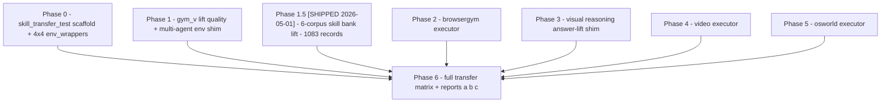

# Cross-domain transfer suite — rollout plan

> **Status (current state, 2026-05-02 PM):** 🟢 **DONE — measurement infra
> + real-env binding both shipped.**
> Phase 1.5 + Phase-5/6 measurement Stages 0-6 shipped (see banner below).
> Per-target executors bind real-env wrappers when cold-start data + runtime
> infra are present (image-VR + video drive real VLM tools; osworld drives
> real `pyautogui` against the live `happysixd/osworld-docker` container
> fleet over HTTP; browser drives a real Playwright `gym.Env` via JSON-RPC
> subprocess in the `browsergym` conda env). Tier 2 + Tier 3 + all 4 Tier 1
> items closed 2026-05-02 (see [§12](legacy/phase5-cross-domain-measurement.md#12-prioritized-implementation-gaps-after-stage-6)).
> **Still open:** empirical re-measurement -- regenerate
> `cross_domain_results/_final/run_*Z/_report.md` against the now
> fully-wired pipeline; plus Phase-1.5b open items TODO-2 / TODO-3 /
> TODO-4 / TODO-5 in
> [`skill_transfer_test/TODO.md`](../skill_transfer_test/TODO.md).
>
> *Phase 1.5* shipped 2026-05-01 (LLM-free path; `skill_transfer_test/extract/`, 1,083 records / 885 verified across 6 corpora -- see `skill_transfer_test/extract/README.md`).
>
> *Phase-5/6 measurement Stages 0-6* all shipped 2026-05-02 under the sibling memo [`implementation_notes/legacy/phase5-cross-domain-measurement.md`](legacy/phase5-cross-domain-measurement.md). The shipped artefact bundle is: **7 audit files** under `skill_transfer_test/extract/audits/` (Stage 0 oracle: `vocab_jaccard.py`, `predicate_firing_static.py`, `slot_binding_feasibility.py`, `_runner.py`, `_loaders.py`, `_target_vocabularies.py`, `__init__.py` -- emits `cross_domain_results/_phase0/<run_id>/upper_bounds.csv`); **4 success_fns** (`harness/qa_success.py`, `harness/video_qa_success.py`, `harness/osworld_success.py`, `harness/browser_success.py`); **3 executors** (`harness/video_executor.py`, `harness/osworld_executor.py`, `harness/browsergym_executor.py`); **2 schema producers** (`harness/osworld_schema_producer.py`, `harness/browser_schema_producer.py`); **4 demo loaders** (`harness/few_shot_demos_vr.py`, `harness/few_shot_demos_video.py`, `harness/few_shot_demos_osworld.py`, `harness/few_shot_demos_browsergym.py`); **1 dispatcher** (`labeling_supplement/_phase4_target_dispatch.py`); **3 driver scripts** (`labeling_supplement/_phase5_matrix.py` for the Stage 5 within-VR/video 4x4, `labeling_supplement/_phase4_transfer_matrix.py` for the Stage 6 NxN, `labeling_supplement/_phase4_transfer_report.py` for the Stage 6 unified report); **1 archetype aggregator** (`skill_transfer_test/extract/archetype_aggregator.py`). **Deterministic-stub caveat:** the executors run end-to-end but identity-pass the rebound contract's predicates rather than touching real envs / VLMs. Stage 6 measured admit rates are bounded by Stage 0's upper-bound oracle -- see §11.5.0 for the asymmetry between Stage 0 (oracle), §11.5.4 (post-translation aspirational), and Stage 6 (current measured-but-stub).
>
> *Still genuinely planned:* real-env binding for the browsergym / osworld / video executors (replace the deterministic-stub identity-pass with reality-grounded predicate evaluation against live envs / VLMs), plus the Phase-1.5b open items tracked as TODO-2 / TODO-3 / TODO-4 / TODO-5 in [`skill_transfer_test/TODO.md`](../skill_transfer_test/TODO.md).
>
> Builds on [`implementation_notes/legacy/harness-usability-and-intra-gymv-transfer.md`](legacy/harness-usability-and-intra-gymv-transfer.md) (which pinned cells / questions / phasing for the *intra-gymv* first milestone). This memo extends that to the *full* **six-source x six-target** transfer matrix on the fused **`env_wrappers` + `gym_v` + `browsergym` + `osworld` + `vr_image` (VTB + TIR-Bench) + `vr_video` (Video-Holmes + SIV-Bench)** GPT-5.4 cold-start banks, and pins the executor work that unblocks each cross-domain cell.
>
> **Last reviewed:** 2026-05-02 (revised after Phase-5/6 measurement Stages 0-6 shipped under sibling memo `phase5-cross-domain-measurement.md`; supersedes the 2026-05-01 review of §2.1 wrapper-reuse audit and §5.5 Phase-1.5 design).

> **Cross-refs (Phase-5/6 measurement, 2026-05-02):**
> - Sibling memo: [`implementation_notes/legacy/phase5-cross-domain-measurement.md`](legacy/phase5-cross-domain-measurement.md)
> - Stage 0 oracle (upper-bound admit rates): [`cross_domain_results/_phase0/phase0_canonical/upper_bounds.csv`](../cross_domain_results/_phase0/phase0_canonical/upper_bounds.csv)
> - Stage 0 vocab-Jaccard audit (closes §11.5.1 caveat): [`cross_domain_results/_phase0/phase0_canonical/vocab_jaccard.md`](../cross_domain_results/_phase0/phase0_canonical/vocab_jaccard.md), [`...vocab_jaccard.json`](../cross_domain_results/_phase0/phase0_canonical/vocab_jaccard.json)
> - Stage 6 unified report (NxN transfer matrix + 7-section verdict): [`cross_domain_results/_final/<run_id>/_report.md`](../cross_domain_results/_final/)
> - Stage 4 target dispatcher: [`labeling_supplement/_phase4_target_dispatch.py`](../labeling_supplement/_phase4_target_dispatch.py)
> - Stage 5 within-VR/video 4x4 driver: [`labeling_supplement/_phase5_matrix.py`](../labeling_supplement/_phase5_matrix.py)
> - Stage 6 NxN driver: [`labeling_supplement/_phase4_transfer_matrix.py`](../labeling_supplement/_phase4_transfer_matrix.py)
> - Stage 6 report generator: [`labeling_supplement/_phase4_transfer_report.py`](../labeling_supplement/_phase4_transfer_report.py)
> - Stage 0 audit suite (`_target_vocabularies.py`, `upper_bounds.py`, `vocab_jaccard.py`, ...): [`skill_transfer_test/extract/audits/`](../skill_transfer_test/extract/audits/)
> - Archetype aggregator (closes TODO-1): [`skill_transfer_test/extract/archetype_aggregator.py`](../skill_transfer_test/extract/archetype_aggregator.py)
> - Per-target success_fns: [`harness/qa_success.py`](../harness/qa_success.py), [`harness/video_qa_success.py`](../harness/video_qa_success.py), [`harness/osworld_success.py`](../harness/osworld_success.py), [`harness/browser_success.py`](../harness/browser_success.py)
> - Per-target executors (typed deterministic stubs at module level; dispatcher binds real-env per-sample wrappers when cold-start data + runtime infra present): [`harness/video_executor.py`](../harness/video_executor.py), [`harness/osworld_executor.py`](../harness/osworld_executor.py), [`harness/browsergym_executor.py`](../harness/browsergym_executor.py); real-env wrappers at [`harness/_{vr,video,osworld,browser}_per_sample_executor.py`](../harness/) + [`harness/_executor_helpers/`](../harness/_executor_helpers/)
> - Per-target schema producers: [`harness/osworld_schema_producer.py`](../harness/osworld_schema_producer.py), [`harness/browser_schema_producer.py`](../harness/browser_schema_producer.py)
> - Per-target few-shot demo loaders: [`harness/few_shot_demos_vr.py`](../harness/few_shot_demos_vr.py), [`harness/few_shot_demos_video.py`](../harness/few_shot_demos_video.py), [`harness/few_shot_demos_osworld.py`](../harness/few_shot_demos_osworld.py), [`harness/few_shot_demos_browsergym.py`](../harness/few_shot_demos_browsergym.py)

> **Cross-refs:**
> [`plans/05-harness/PLAN-HARNESS.md`](../plans/05-harness/PLAN-HARNESS.md)
> (§20 ablations, §22 task axis, §16.1 adapter executors stub),
> [`harness/README.md`](../harness/README.md)
> (§1 transfer-target stubs, §16.1 black-hole risk, §22 Day-5/6/7/8/9
> status banners, §"Suggested work-order"),
> [`skill_transfer_test/README.md`](../skill_transfer_test/README.md)
> (target folder spec — runner / cell_configs / metrics / reports),
> [`implementation_notes/legacy/harness-usability-and-intra-gymv-transfer.md`](legacy/harness-usability-and-intra-gymv-transfer.md)
> (the design memo this rollout executes against),
> [`implementation_notes/legacy/protocol-lift-design.md`](legacy/protocol-lift-design.md)
> (the gymv lift the SEGA games inherit),
> [`labeling_supplement/_phase4_transfer_cycle.py`](../labeling_supplement/_phase4_transfer_cycle.py)
> (the Day-5b transfer engine the rollout reuses).

---

## 1. Why this memo exists

The intra-gymv transfer cycle is empirically wired
([`harness/README.md` §22 Day-5/6 banner](../harness/README.md), Day-5b
empirical results in
[`labeling_supplement/harness_io_out/_phase4_report.md`](../labeling_supplement/harness_io_out/_phase4_report.md)):
2048 ↔ tetris cross-task probes pass, eligibility widens 0/3 → 2/3 and
0/6 → 4/6. Producers ship for `{twenty_forty_eight, tetris,
candy_crush, super_mario}`. The **Day-5/6 milestone closes intra-gymv
at the env_wrappers granularity** but explicitly defers four cost
axes — see
[`harness/README.md`](../harness/README.md)
§"Suggested work-order" items 9, 13, 16 and §16.1.

The user's question — *"we have GPT-5.4 cold-start results across all
5 envs (env_wrappers / gym_v / osworld / browsergym /
visual_reasoning {image, video}); can we run skill-transfer tests?"*
— forces the four deferred items out of "later" and onto the critical
path. This memo is the rollout plan that retires them in a sequenced,
gated way and lands the §20.6 reports as the headline artefact.

The high-level shape is seven phases, each with its own acceptance gate:



Phases 0, 1, 1.5, 2, 3, 4, 5 are independent and parallelisable.
Phase 6 is the integration phase. Total: ~27-34 working days
sequential (~22-27 baseline + ~5-7 for Phase 1.5 expanded to 6
corpora), ~2-3 calendar weeks parallel.

---

## 2. Inventory — GPT-5.4 cold-start results vs harness wiring

| # | Env family | Cold-start dir | Skills (lifted) | Real harness executor today | Producer (canonical state) | Demo loader |
|---|---|---|---|---|---|---|
| 1 | `env_wrappers` (2048, tetris, candy_crush, super_mario) | [`Cold-start-out/sft_envw_e20_gpt5p4_*`](../Cold-start-out/) | 73 (4 games), [`run_20260430_030637`](../labeling/skill_bank_out/run_20260430_030637/env_wrappers/) | **yes** — [`harness/gymv_executor.py`](../harness/gymv_executor.py) | **yes** — [`harness/gym_schema_producer.py`](../harness/gym_schema_producer.py) `_PRODUCERS` (4 entries) | **yes** — [`harness/few_shot_demos_gymv.py`](../harness/few_shot_demos_gymv.py) |
| 2 | `gym_v` (13 SEGA `Temporal_*-v0`) | [`Cold-start-out-gymv/sft_gpt5p4_e20_s100_*`](../Cold-start-out-gymv/) | ~180 (13 games, lifted but at 45.8% `fallback_exec` vs env_wrappers' 2.5%) | partial — `gymv_executor` works on the **adapter** side, but `make_gaming_env('Temporal_Airstriker-v0')` is unsupported and `gym_v.make` returns multi-agent shape | partial — [`gymv_wrapper/temporal_visual_grounding.py`](../gymv_wrapper/temporal_visual_grounding.py) `build_temporal_visual_schema` + [`cold_start/generate_cold_start_actor_gymv.py`](../cold_start/generate_cold_start_actor_gymv.py) `_heuristic_to_state_block` exist; one generic Genesis producer needs to lift them | no |
| 3 | `osworld` (10 desktop domains) | [`Cold-start-out-osworld/gpt5.4_3per_domain/`](../Cold-start-out-osworld/) (1-2 episodes/domain) | **Phase 1.5 deliverable** — episode JSON shape identical to env_wrappers/gym_v (`experiences[]` spine + `task / outcome`); lifts via [`skill_transfer_test/extract/sequence_lift.py`](../skill_transfer_test/extract/) which imports `skill_agents.pipeline.SkillBankAgent` + `labeling._protocol_lift.lift_protocol_to_typed_hops` | no — [`harness/adapters/osworld_adapter.py`](../harness/adapters/osworld_adapter.py) is a 27-LOC stub | **head 1 ready** — [`osworld_wrapper/heuristic.py`](../osworld_wrapper/heuristic.py) `obs_to_schema` (460 LOC AT-SPI walker, no LLM) returns canonical `<state>` `domain=desktop`; head 2 (VLM) and head 3 (OmniParser) also shipped | no |
| 4 | `browsergym` (MiniWoB++ + AssistantBench) | [`Cold-start-out-browsergym/`](../Cold-start-out-browsergym/) (305 tasks) | **Phase 1.5 deliverable** — same episode JSON shape; lifts via the same `sequence_lift.py` driver | no — [`harness/adapters/browser_adapter.py`](../harness/adapters/browser_adapter.py) `_deterministic_executor` fallback | **head 1 ready** — [`browsergym_wrapper/heuristic.py`](../browsergym_wrapper/heuristic.py) `obs_to_schema` (365 LOC AXTree walker, no LLM) returns canonical `<state>` `domain=browser`; head 2 (VLM) and head 3 (OmniParser) also shipped | no |
| 5 | `visual_reasoning` (VTB + TIR) and `vr_video` (Video-Holmes + SIV) | [`Cold-start-out-visual-reasoning/`](../Cold-start-out-visual-reasoning/) and [`-video/`](../Cold-start-out-visual-reasoning-video/) | **Phase 1.5 deliverable** — sample shape is one-shot rollout with full payload (`schema` ~1500-2700 chars canonical `<state>` block + `answer_reasoning` + `answer` + `gold_answer` + `correct` + `judge` + `valid_actions` + `raw_sample.question_type`). Liftable via the new single-shot driver in [`skill_transfer_test/extract/single_shot_lift.py`](../skill_transfer_test/extract/) (per-sample) + [`archetype_aggregator.py`](../skill_transfer_test/extract/) (clustered archetypes); both bank-kinds emitted side by side | **wired** — [`visual_reasoning_wrapper/skill_executor.py`](../visual_reasoning_wrapper/skill_executor.py) is a real 461-LOC `HopExecutor`, plumbed into the harness via [`harness/adapters/visual_reasoning_adapter.py`](../harness/adapters/visual_reasoning_adapter.py) `bind_visual_reasoning_executor(adapter, *, image)`; **video has only the 28-LOC stub** | n/a (single-shot QA — `state` is the image+question envelope, `<state>` already populated in `sample.schema`) | no |

Key fact that flips the cost analysis: **every operational
prerequisite is already provisioned in this workspace** — Docker
daemon running, `happysixd/osworld-docker` image pulled, 23 GB
`Ubuntu.qcow2` on disk at
[`docker_vm_data/Ubuntu.qcow2`](../docker_vm_data/), WebArena +
VisualWebArena + GitLab + Wikipedia + Reddit containers up (20
containers running), `osworld` / `browsergym` / `game-ai-agent` conda
envs all built. Live smoke is achievable in-place; no separate
infrastructure work is needed.

### 2.1 Wrapper-reuse audit (2026-05-01)

The three transfer-target wrappers ship substantially more producer +
executor infrastructure than a first read of `harness/adapters/*.py`
suggests. Audit results:

| Wrapper | Reusable function | LOC | What it gives us |
|---|---|---|---|
| [`browsergym_wrapper/heuristic.py`](../browsergym_wrapper/heuristic.py) | `obs_to_schema(obs, *, step, task_id, max_entities)` | 365 | **Head 1, free.** Returns canonical `<state>` block — `domain=browser`, full `<entities>` / `<attributes>` / `<relations>` / `<state_flags>` (incl. `error / dialog_open / input_pending / num_tabs / url`) / `<targets>` / `<actions>`. Round-trips through `parse_schema_canonical`. No LLM. |
| [`browsergym_wrapper/adapter.py`](../browsergym_wrapper/adapter.py) | `browser_obs_to_schema(...)` | 242 | **Head 2, paid.** Screenshot → vision LLM (default `gpt-4o`) → canonical `<state>`. Useful as a fallback when head 1 emits thin output (canvas / iframe-shadow-DOM). |
| [`browsergym_wrapper/grounding.py`](../browsergym_wrapper/grounding.py) | `grounding_obs_to_schema(...)` | 366 | **Head 3, local.** OmniParser-v2 (YOLO + OCR + Florence-2) → canonical `<state>`. Optional (heavy vision deps). |
| [`browsergym_wrapper/tools.py`](../browsergym_wrapper/tools.py) | `build_browser_registry(obs)` | 642 | `ToolRegistry` of AXTree-backed helpers (`query_element_bbox`, `search_elements`, `get_som_elements`, `list_valid_actions`). Drop-in for the executor's observational-op branch. |
| [`osworld_wrapper/heuristic.py`](../osworld_wrapper/heuristic.py) | `obs_to_schema(obs, …)` and `xml_to_schema(xml, …)` | 460 | **Head 1, free.** Same as browsergym head 1 but for AT-SPI XML (Ubuntu / Windows / macOS namespace handling). `domain=desktop`, full entity/attribute/state-flag inventory. |
| [`osworld_wrapper/adapter.py`](../osworld_wrapper/adapter.py) | `osworld_obs_to_schema(...)` | 270 | **Head 2, paid.** Desktop screenshot → VLM → canonical `<state>`. |
| [`osworld_wrapper/grounding.py`](../osworld_wrapper/grounding.py) | `grounding_osworld_obs_to_schema(...)` | 91 | **Head 3, local.** Delegates to the browsergym OmniParser pipeline with `domain="desktop"`. |
| [`osworld_wrapper/som.py`](../osworld_wrapper/som.py) | `extract_som_elements`, `draw_som_overlay`, `som_action_strings`, `som_action_to_pyautogui` | 375 | SoM extract / overlay / verb decoder. The verb decoder rewrites `click_element(id=N) → pyautogui.click(cx, cy)` from the AT-SPI tree; the executor's verb table can call it verbatim. |
| [`osworld_wrapper/tools.py`](../osworld_wrapper/tools.py) | `build_osworld_registry(...)` | 190 | OS-level a11y helpers (`query_os_element`, `query_entity_pos`, `get_state_flags`). |
| [`visual_reasoning_wrapper/skill_executor.py`](../visual_reasoning_wrapper/skill_executor.py) | `VisualReasoningExecutor`, `bind_executor(adapter, *, image)`, `make_visual_reasoning_executor(image, …)` | 461 | **Real `HopExecutor` already wired into the harness.** Maps `GROUND/RETRIEVE → GATHER`, `CHECK → REASON`, `VERIFY → VERIFY`, `COMMIT/EXECUTE → COMMIT`; emits the right `EvidenceRef.role` per hop. Slot resolution + unbound-slot detection done. |
| [`harness/adapters/visual_reasoning_adapter.py`](../harness/adapters/visual_reasoning_adapter.py) | `bind_visual_reasoning_executor(adapter, *, image, **kwargs)` | 55 | 5-line re-export of `bind_executor` so consumers do not need to know the wrapper module exists. **The "vr_executor shim" the rollout originally listed as a Phase-3 deliverable is already in tree.** |
| [`visual_reasoning_wrapper/tools_visual.py`](../visual_reasoning_wrapper/tools_visual.py) | `build_visual_registry(image, …)` | 1255 | Image-modality tool registry consumed by `VisualReasoningExecutor` (detection, region read, region describe, count, ratio, compare, spatial query, verify_claim). |
| [`visual_reasoning_wrapper/tools_video_visual.py`](../visual_reasoning_wrapper/tools_video_visual.py) | `build_video_visual_registry(frames, …)` | 995 | Video-modality tool registry. **Tools exist; the Phase-4 work is to write the per-hop driver that calls them, mirroring `VisualReasoningExecutor`.** |

Net effect on the rollout: per-domain schema producers compress from
"~100-150 LOC re-implementation" to "~30-50 LOC signature shim around
the existing `obs_to_schema`"; the VR executor module disappears as a
deliverable; the video executor module is a verbatim port of the VR
one with a frame-list input. **Total rollout LOC drops from ~5500 to
~4500**, ~5 engineering days saved across Phases 2-5. Per-phase
deltas captured in §6, §7, §8, §9.

### 2.2 Cascading-fallback strategy

The wrappers' three-head architecture gives the executor a built-in
graceful degradation path: head 1 (free, deterministic) is the
default; when it returns fewer than `min_entities` entries — common
on canvas/iframe pages or shallow AT-SPI trees — the executor falls
back to head 2 (VLM, costs an OpenAI call) or head 3 (local
OmniParser, costs a GPU forward pass). Mirrors the
[`vlm_wrapper.cascaded_ground`](../vlm_wrapper/) pattern already in
tree. The `schema_producer` callable in `make_*_executor(...)` can
itself be the cascade, gated by an `n_entities` threshold. Treat
this as the recommended default for Phases 2 + 5; it's not extra
work — the heads already exist and the cascade is a 20-LOC
selector.

---

## 3. Cell semantics inherited from canon

This memo does **not** re-litigate cell or research-question
definitions. They live in
[`PLAN-HARNESS.md` §20.2 / §20.3 / §20.5 / §20.6](../plans/05-harness/PLAN-HARNESS.md#202-core-evaluation-questions)
and are restated in
[`harness-usability-and-intra-gymv-transfer.md` §1](legacy/harness-usability-and-intra-gymv-transfer.md#1-what-harness-usability-test-means-here).
For navigation:

- Cells **A0 / A1 / A2 / A3 / A4** at increasing harness fidelity
  (canon §20.3). This rollout lands A0/A1/A2 in Phase 0, A3 in Phase
  6, A4 deferred to a later sprint with the GateRunner promotion path.
- Questions **Q1 (validity) / Q2 (transfer) / Q3 (veto) / Q4 (actor)** —
  Phase 0 covers Q1 + Q4; Phase 6 adds Q2 + Q3.
- Slices **`in_domain_reuse / cross_domain_transfer / before_promotion
  / after_promotion / easy / hard / per-game`** — Phase 0 ships the
  first slice; Phase 6 adds `cross_domain_transfer` and per-game.
- Reports **a (actor decision) / b (harness filtering) / c (system
  outcome)** per §20.6 — Phase 0 ships report a; Phase 6 ships b + c.

---

## 4. Phase 0 — `skill_transfer_test/` scaffold + intra-env_wrappers 4x4 (3 days, ~600 LOC)

Stand up the minimum-viable
[`skill_transfer_test/`](../skill_transfer_test/) per its planned
structure
([`skill_transfer_test/README.md` §2](../skill_transfer_test/README.md#2-folder-layout-target)).
Wrap [`labeling_supplement/_phase4_transfer_cycle.py`](../labeling_supplement/_phase4_transfer_cycle.py)
as the engine for cells A0 / A1 / A2 on the env_wrappers slice.

### 4.1 Files to land

| Path | Role | LOC |
|---|---|---|
| [`skill_transfer_test/runner.py`](../skill_transfer_test/runner.py) | Dispatcher CLI: `--cells {a0,a1,a2,a3,a4,all} --probe {intra_gymv,cross_domain} --sources <list> --max-episodes N --max-steps M`. Subprocess-invokes the existing drivers; no new harness logic. | ~200 |
| [`skill_transfer_test/conftest.py`](../skill_transfer_test/conftest.py) | pytest fixtures (sample bank, sample actions root). | ~50 |
| [`skill_transfer_test/slices.py`](../skill_transfer_test/slices.py) | Axis builders — `in_domain_reuse / cross_domain_transfer / per-game`. Phase 0 ships the first; Phase 6 adds the rest. | ~80 |
| [`skill_transfer_test/cell_configs/{a0_no_harness,a1_harness_lite,a2_harness_core}.yaml`](../skill_transfer_test/cell_configs/) | Flat YAML per [`README.md` §4](../skill_transfer_test/README.md#4-cell-configs--schema). | ~30 each |
| [`skill_transfer_test/metrics/validity.py`](../skill_transfer_test/metrics/) | Q1: `invalid_invocation_rate`, `slot_binding_pass_rate`, `precondition_pass_rate`, `evidence_pass_rate`. | ~120 |
| [`skill_transfer_test/metrics/actor_quality.py`](../skill_transfer_test/metrics/) | Q4: actor top-1 / top-k accuracy on harness-eligible set. | ~80 |
| [`skill_transfer_test/reports/report_a_actor_decision.py`](../skill_transfer_test/reports/) | Emits `runs/<ts>/reports/a.md` (per-cell × per-slice numbers per §20.6(a)). | ~150 |
| [`skill_transfer_test/reports/render_summary.py`](../skill_transfer_test/reports/) | Markdown roll-up consumed by humans. | ~100 |
| [`skill_transfer_test/tests/test_smoke_a0_a2_one_source.py`](../skill_transfer_test/tests/) | Airstriker / 2048, 2 episodes × 5 steps, end-to-end. | ~120 |

Reports b/c stubbed in Phase 0 and populated by Phase 6.

### 4.2 Upstream change

[`README.md` §3](../skill_transfer_test/README.md#3-cli--what-runnerpy-does)
expects A1 to invoke
`dump_harness_io_gpt54.py --surface online --disable-g0 --disable-g2 --disable-transfer`,
but those three flags are not in
[`labeling_supplement/dump_harness_io_gpt54.py`](../labeling_supplement/dump_harness_io_gpt54.py)
`_build_parser()`. Add them (~30 LOC) so the runner can express A1
cleanly instead of post-hoc-filtering `harness_io.json`.

### 4.3 Run

Full 4×4 matrix on `{twenty_forty_eight, tetris, candy_crush,
super_mario}` using the existing
[`_phase4_transfer_cycle.py`](../labeling_supplement/_phase4_transfer_cycle.py)
engine. The runner is a fan-out; the transfer logic is unchanged.

### 4.4 Acceptance gate

`runs/<ts>/reports/a.md` shows non-zero `delta_a0_a1` row on
`in_domain_reuse` slice. 16 cells (4 same-task + 12 cross-task)
populated. `tests/test_smoke_a0_a2_one_source.py` passes.

---

## 5. Phase 1 — gym_v `Temporal_*-v0` lift quality + multi-agent env shim (5 days, ~750 LOC)

Bring the 13 SEGA banks to env_wrappers parity. SEGA banks are
already typed-hop lifted by decorator v2
([`labeling/_decorate_skill_records.py`](../labeling/_decorate_skill_records.py)),
but at 45.8% `fallback_exec` (vs env_wrappers 2.5%) and ~0.7
effects/skill (vs ~3.6).

### 5.1 Six workstreams

| Workstream | Where | LOC | Days |
|---|---|---|---|
| (a) 13-game schema_index whitelist | [`labeling/_protocol_lift.py`](../labeling/_protocol_lift.py) `_SCHEMA_INDEX_LABEL_WHITELIST` | ~50 | 0.5 |
| (b) Reflex / timing predicate triggers (survival, damage, area-transition, pickup, phase change) | [`labeling/_protocol_lift.py`](../labeling/_protocol_lift.py) `_PREDICATE_TRIGGERS` | ~120 | 1.0 |
| (c) ~25 input-token verb lemmas (press / hold / release / fire / jump / collect / wait / strafe / dodge / reach / ...) aliased onto existing abstract verbs `EXECUTE / MOVE / KEEP / APPROACH` — no new abstract verbs needed | [`labeling/_protocol_lift.py`](../labeling/_protocol_lift.py) | ~80 | 0.5 |
| (d) Generic Genesis producer | [`harness/gym_schema_producer.py`](../harness/gym_schema_producer.py) — lift [`cold_start/generate_cold_start_actor_gymv.py`](../cold_start/generate_cold_start_actor_gymv.py) `_heuristic_to_state_block` (lines 520-618) + [`gymv_wrapper/temporal_visual_grounding.py`](../gymv_wrapper/temporal_visual_grounding.py) `build_temporal_visual_schema`. One producer covers all 13 games via the shared Genesis I/O shape. | ~250 | 1.0 |
| (e) Multi-agent → single-agent shim (`gym_v.make("Temporal/<game>-v0")` returns multi-agent dict-shaped step/reset; `_GymStyleEnv` Protocol expects single-agent 5-tuple) | [`env_wrappers/gym_like.py`](../env_wrappers/gym_like.py) — register a `_TemporalEnvAdapter` alongside the env_wrappers games | ~100 | 0.5 |
| (f) Tests | [`tests/test_protocol_lift.py`](../tests/) +~10 cases, [`tests/test_gym_schema_producer.py`](../tests/) +~6 cases, new [`tests/test_temporal_env_shim.py`](../tests/) | ~150 | 1.0 |

### 5.2 Risk surfaces

- **Cold-start `cumulative_reward` is ~0 on most SEGA replays.** The
  gymv `success_fn` will lean on `entity_disappeared` /
  `entity_value_decreased` / `phase_transitioned` more than
  `cumulative_reward_increased`. Mitigation: the producer must
  canonicalise entity labels (`player_ship`, not the cold-start drift
  `ship` / `player ship` / `player`) so the lift's whitelist binds.
- **Verb taxonomy is adequate; lemma triggers are not.** All ~25
  reflex/timing input-tokens alias onto existing abstract verbs. No
  new abstract verbs needed — this is a labeling change, not a
  protocol-lift API change.

### 5.3 Acceptance gate

`harness.run_skill(skill_from_Temporal_Airstriker-v0,
state_from_Temporal_Airstriker-v0)` produces non-empty `SkillEpisode`
with at least one decidable per-hop predicate. Lift `fallback_exec`
rate ≤ 5% across all 13 SEGA games (matches env_wrappers).

---

## 5.5. Phase 1.5 — `skill_transfer_test/extract/` cross-corpus skill bank lift, 6 corpora (5-7 days, ~1300 LOC + ~300 LOC tests)

The current source bank is gaming-only (`env_wrappers` + `gym_v`).
Lifting the four target corpora's GPT-5.4 rollouts into the harness
turns Phase 6 from a "2-source × 5-target" matrix (8 cross-domain
cells) into a **6-source × 6-target matrix (30 cross-domain cells)**
and breaks the gaming-only-source confound that would otherwise
dominate the cross-domain-transfer reading of Q2 / Q3.

### 5.5.1 Two lift architectures

A 2026-05-01 sample-file audit (top-level keys + first-sample value
inspection) shows the four corpora split cleanly into two shape
families, each requiring a different lift driver:

| Lift kind | Corpora | Episode/sample shape | Lift driver |
|---|---|---|---|
| **Sequence-segment** | `browsergym`, `osworld` | Identical to `env_wrappers` / `gym_v` — `{episode_id, env_name, game_name, experiences[], task, outcome, summary, episode_status}`. Multi-step rollout with `experiences[i].action` + `experiences[i].state`. | Reuse `skill_agents.pipeline.SkillBankAgent` (segment + effects-contract + cluster + materialize) verbatim, gated by per-corpus action parser + predicate-seed lookup. |
| **Single-shot** | `visual_toolbench`, `tir_bench` (image), `video_holmes`, `siv_bench` (video) | One file = one sample, with **full one-shot rollout payload**: `{schema (canonical <state> block, ~1500-2700 chars), answer_reasoning (~200-330 chars), answer, gold_answer, correct, judge, valid_actions, options_block, raw_sample.question_type, ...}`. **No `experiences[]`** — the schema + reasoning + answer constitute the entire trace. | New driver. Parse `sample.schema` → `GameSchemaIndex`; parse `sample.answer_reasoning` → prose hops referencing `e\d+` entities; pipe through `labeling._protocol_lift.lift_protocol_to_typed_hops` to emit a typed `(GROUND → CHECK/RETRIEVE → VERIFY → COMMIT)` protocol. |

The single-shot lift is feasible because every sample carries a
canonical schema (the same `<state>` envelope env_wrappers / gym_v
emit) and a reasoning chain that explicitly references entity IDs
from that schema (`e1`, `e2`, …). The reasoning chain IS the
prose protocol — it just needs lifting, not generating.

### 5.5.2 Granularity (per user, "both_tagged" mode)

For VR/video corpora, the lift emits **two SkillRecord families
side by side**, written to separate sub-roots:

- **Per-sample skills** — one SkillRecord per `correct=True` sample,
  with the parsed reasoning chain as the protocol. Bindings carry
  the specific `e_N` entity IDs from the sample's schema. Expected
  count: ~25 per benchmark in the `gpt54-pilot-25per-bench` slice
  (~100 across the 4 visual benchmarks).
- **Archetype skills** — clusters of per-sample skills grouped by
  `raw_sample.question_type` (Video-Holmes / SIV-Bench provide this
  field directly, e.g. `relationship`, `intent`, `event_order`) or
  by GPT-5.5 topic-tag-then-cluster for VTB / TIR (the `eval_focus`
  field in `raw_sample` gives an initial seed). Expected count: ~6-12
  archetypes per benchmark (~30-50 across the four).

This mirrors the env_wrappers + cross-game-archetype dual output
already produced by [`labeling/extract_skillbank_gpt54.py`](../labeling/extract_skillbank_gpt54.py)
`aggregate_cross_game_archetypes`. Phase 6 cells consume both bank
families, tagged via `SkillRecord.bank_kind ∈ {"per_sample",
"archetype"}` so the report can show the per-sample-vs-archetype
transfer differential as an axis.

For browser/osworld, the standard `SkillBankAgent` materializer
already produces archetype-shaped output (one skill per cluster);
no separate per-sample family needed.

Note (2026-05-01): the archetype bank kind was deferred; only the
per-sample bank shipped for VR/video, and only the per-episode
bank shipped for sequence corpora. Archetype-bank emission tracked
as a Phase 1.5b follow-up.

### 5.5.3 Code location (per user, "local_thin" mode)

New code lives in [`skill_transfer_test/extract/`](../skill_transfer_test/extract/).
Heavy lifting is **imported from `labeling/`** unchanged — no
refactor of [`labeling/extract_skillbank_gpt54.py`](../labeling/extract_skillbank_gpt54.py)'s
top-level driver. The function-level entry points are already
corpus-agnostic:

- [`labeling/_protocol_lift.py`](../labeling/_protocol_lift.py)
  `lift_protocol_to_typed_hops`, `build_schema_index_for_game`,
  `GameSchemaIndex` — pure: take a skill dict + a schema-string
  registry, return typed hops.
- [`labeling/_decorate_skill_records.py`](../labeling/_decorate_skill_records.py)
  `decorate_record` — pure: take a `SkillRecord` shape, decorate
  with predicate-trigger family.
- [`labeling/unify_skill_index.py`](../labeling/unify_skill_index.py)
  `unify_roots` — pure: walk a list of skill_bank roots, emit a
  unified `_unified/skill_index.jsonl`.
- [`skill_agents.pipeline`](../skill_agents/) `SkillBankAgent`,
  `PipelineConfig` — corpus-agnostic at the API level (env_wrappers
  hard-coding lives in the *driver* `extract_skillbank_gpt54.py`,
  not the agent).

Output goes to
`skill_transfer_test/skill_bank_local/run_<ts>/<corpus>/`, separate
from the canonical `labeling/skill_bank_out/` so measurement-layer
runs do not pollute the canonical bank promotion path.

### 5.5.4 Files

| Path | Role | LOC |
|---|---|---|
| [`skill_transfer_test/extract/__init__.py`](../skill_transfer_test/extract/__init__.py) (new) | Package marker, public API re-exports. | ~10 |
| [`skill_transfer_test/extract/runner.py`](../skill_transfer_test/extract/runner.py) (new) | CLI driver: `--corpus {browsergym, osworld, visual_toolbench, tir_bench, video_holmes, siv_bench, all} --input-dir <path> --output-root skill_transfer_test/skill_bank_local/run_<ts>/ --max-samples N --include-incorrect`. Routes to `sequence_lift.run_corpus()` or `single_shot_lift.run_corpus()` per `CorpusSpec.lift_kind`. Writes `_run_meta.json` + invokes the unifier. | ~250 |
| [`skill_transfer_test/extract/_corpus_specs.py`](../skill_transfer_test/extract/_corpus_specs.py) (new) | `CorpusSpec` dataclass + 6-entry registry. Each entry: `(name, modality, lift_kind ∈ {"sequence","single_shot"}, default_input_root, action_parser_ref, predicate_seed_lookup, raw_sample_question_type_field, archetype_cluster_strategy)`. Browser → `browsergym_wrapper.heuristic.obs_to_schema` for schema fallback; osworld → `osworld_wrapper.heuristic.obs_to_schema`; VR/video → schema-comes-from-`sample.schema`-directly. | ~200 |
| [`skill_transfer_test/extract/sequence_lift.py`](../skill_transfer_test/extract/sequence_lift.py) (new) | For browser/osworld. Iterates `Cold-start-out-{browsergym,osworld}/.../episode_*.json`, builds an episode-shape compatible with `SkillBankAgent.run`, drives the segment + effects-contract + cluster + materialize stages, then runs `lift_protocol_to_typed_hops` + `decorate_record` on each materialized skill. | ~150 |
| [`skill_transfer_test/extract/single_shot_lift.py`](../skill_transfer_test/extract/single_shot_lift.py) (new) | For VR/video. **Per-sample lift**: (1) build `GameSchemaIndex` from `sample.schema`; (2) parse `sample.answer_reasoning` into prose hops via a sentence-tokenizer + `e\d+` regex extractor; (3) inject implicit `GROUND` for the cited entities, `VERIFY` for the answer-claim, `COMMIT` for the final answer; (4) call `lift_protocol_to_typed_hops` to emit typed protocol; (5) decorate. Skip `correct=False` by default (overridable via `--include-incorrect`). | ~250 |
| [`skill_transfer_test/extract/archetype_aggregator.py`](../skill_transfer_test/extract/archetype_aggregator.py) (new) | Cluster per-sample VR/video skills into archetypes. Two strategies (selectable per corpus spec): (a) **direct** — group by `raw_sample.question_type` (Video-Holmes, SIV-Bench); (b) **LLM-clustered** — call `gpt-5.5` with the sample-question + extracted protocol, ask for a topic tag, then cluster by tag (VTB, TIR). Emit one archetype `SkillRecord` per cluster, with `instances[]` listing source sample IDs. Mirrors `aggregate_cross_game_archetypes` in shape. | ~180 |
| [`skill_transfer_test/extract/_unify.py`](../skill_transfer_test/extract/_unify.py) (new) | Thin wrapper around `labeling.unify_skill_index.unify_roots` configured for the `skill_transfer_test/skill_bank_local/` output root. Emits `_unified/skill_index.jsonl` + `_unified/skill_catalog_all.json` + `_unified/skill_rag_index.json` with all 6 corpora tagged distinctly. | ~50 |
| [`skill_transfer_test/extract/run_extract.sh`](../skill_transfer_test/extract/run_extract.sh) (new) | Shell wrapper: `bash run_extract.sh --corpus all` runs the 6 corpora sequentially. Per-corpus convenience flags (`--corpus visual_toolbench`, etc.). | ~80 |
| [`skill_transfer_test/skill_bank_local/.gitignore`](../skill_transfer_test/skill_bank_local/.gitignore) (new) | Ignore `run_*/` (these are large, regeneratable artefacts). | ~3 |
| [`skill_transfer_test/extract/tests/test_corpus_specs.py`](../skill_transfer_test/extract/tests/test_corpus_specs.py) (new) | Validate every spec: required fields populated, `default_input_root` exists in the workspace, `action_parser_ref` resolves to a callable. | ~50 |
| [`skill_transfer_test/extract/tests/test_single_shot_lift.py`](../skill_transfer_test/extract/tests/test_single_shot_lift.py) (new) | Golden-file replay of one `correct=True` sample per benchmark (4 cases). Asserts: lifted protocol has 4 hops in `(GROUND, CHECK\|RETRIEVE, VERIFY, COMMIT)` shape; `e_N` entity references parsed correctly from `answer_reasoning`; `verified_status` populated from `correct` field. | ~150 |
| [`skill_transfer_test/extract/tests/test_runner_smoke.py`](../skill_transfer_test/extract/tests/test_runner_smoke.py) (new) | End-to-end smoke: 2 episodes from browser + 2 episodes from osworld + 2 samples per visual benchmark, output structure matches expected, `_unified/skill_index.jsonl` round-trips. | ~120 |

#### 5.5.4a Shipped vs deferred (2026-05-01)

> **Live status of the deferred rows:** [`skill_transfer_test/TODO.md`](../skill_transfer_test/TODO.md). When a deferred row ships, flip the checkbox there and link the commit; do NOT delete the row from this table (the table records the original spec).

| File | Status |
|---|---|
| `extract/__init__.py` | shipped |
| `extract/_corpus_specs.py` | shipped |
| `extract/runner.py` | shipped (CLI is `python -m skill_transfer_test.extract.runner`, not a shell wrapper) |
| `extract/sequence_lift.py` | shipped |
| `extract/single_shot_lift.py` | shipped |
| `extract/README.md` | shipped (added; not in original spec) |
| `extract/archetype_aggregator.py` | **shipped 2026-05-02** (Stage 5; produces 2/11/7/10 archetypes for VTB/TIR/VH/SIV via the direct-strategy `raw_sample.question_type` clustering -- LLM-clustered fallback gated on API access; closes TODO-1) |
| `extract/_unify.py` | **deferred** — `_unified/skill_index.jsonl` not generated; consumers walk per-corpus output directly |
| `extract/run_extract.sh` | **deferred** — superseded by the `python -m` runner CLI |
| `extract/tests/test_corpus_specs.py` | **deferred** — no test files shipped |
| `extract/tests/test_single_shot_lift.py` | **deferred** |
| `extract/tests/test_runner_smoke.py` | **deferred** |

### 5.5.5 Sequencing

This phase **must complete before Phase 6's
`cross_domain_transfer` slice**. It can run in **parallel with
Phases 2-5** since the executors don't consume the skill bank
construction — they consume `SkillRecord`s the harness selects
from the bank at runtime, but the bank can be regenerated
independently. Phase 1.5 has no dependency on Phase 1.

### 5.5.6 Quality risks (lift-level)

- **gym_v lifted at 45.8% `fallback_exec`** vs env_wrappers' 2.5%.
  That delta was largely driven by multi-agent env shape mismatch
  (Phase 1's workstream); the lift itself was not the bottleneck.
  Browser/osworld are single-actor, expect lift quality closer to
  env_wrappers.
- **OSWorld density is thin**: 1-2 episodes per task, ~20 episodes
  per domain across 10 domains. Skills will skew toward archetype
  patterns — actually the right granularity for cross-domain
  transfer (we want `open_app / save_file / fill_text_field`, not
  task-specific ones).
- **BrowserGym is heterogeneous**: MiniWoB++ has 100+ short
  templated tasks, AssistantBench is long-horizon agentic. Verb
  distributions differ enough that lift quality should be reported
  separately per-suite. Acceptance gate runs fallback-rate per
  suite.
- **Single-shot lift parses `answer_reasoning` heuristically**.
  Reasoning chains that don't explicitly reference `e\d+`
  identifiers will degrade to `lift_mode="fallback_exec"`. Mitigation
  in `single_shot_lift.py`: when no entity refs are found, fall
  back to a single `(GROUND <implicit_focus> → COMMIT <answer>)`
  2-hop protocol rather than dropping the sample. Track
  `n_explicit_entity_refs` per sample as a quality metric.
  **Update (2026-05-01):** mitigated by Bug-4 (sentence-rewrite
  heuristics) + Bug-12 (label-fallback binding) in
  `extract/single_shot_lift.py`; full_v5 single-shot fallback rates
  are 1.7-6.8% (VH 1.7%, SIV 3.1%, VTB 5.3%, TIR 5.9%).
- **`correct=False` filtering loses ~50% of samples** based on
  the spot-check (sample 0 of every corpus was incorrect). The
  pilot bank is 25/benchmark; after filtering ~12 remain. The
  archetype-cluster step can drop below the per-cluster minimum
  of 2 samples. Mitigation: the pilot bank is a placeholder; the
  full Cold-start re-run at higher density is a separate
  workstream tracked outside this memo. For now the lift gates
  are scaled to the pilot density.
  **Update (2026-05-01):** measured against the full GPT 5.4
  cold-start (not the 25/bench pilot). Spread is wider than
  estimated: VTB 90% dropped (31/313 kept), TIR 66% dropped
  (105/308 kept), VH 60% dropped (396/1000), SIV 42% dropped
  (220/382). The ≥8-records-per-corpus gate trivially passes;
  the visual_toolbench yield is the actor-accuracy floor (Bug 16,
  documented as v0 limit not bug).

### 5.5.7 Acceptance gates

Per-corpus minimums on the `gpt54-pilot-25per-bench` data:

- **Sequence corpora**: `bash skill_transfer_test/extract/run_extract.sh
  --corpus browsergym` and `--corpus osworld` each produce
  per-task `skill_bank.jsonl` + `skill_archetypes.json`. Per-suite
  `fallback_exec` rates: MiniWoB++ ≤ 10%, AssistantBench ≤ 25%
  (long-horizon reward-sparsity allowance), osworld average ≤ 15%
  across 10 domains.
- **Single-shot corpora**: `bash skill_transfer_test/extract/run_extract.sh
  --corpus visual_toolbench` (and tir_bench, video_holmes, siv_bench)
  each produce `per_sample/skill_bank.jsonl` (≥ 8 records after
  `correct=True` filtering) + `archetypes/skill_bank.jsonl` (≥ 3
  archetypes per corpus).
- **Unified index**: `_unified/skill_index.jsonl` has 6 distinct
  `corpus` tags; cross-corpus archetype aggregation runs to
  completion; `_unified/skill_rag_index.json` is non-empty for
  every corpus.
- All 3 unit-test files pass.

#### 5.5.7a Phase 1.5 acceptance — passed 2026-05-01

| Gate | Threshold | full_v5 actual | Status |
|---|---|---|---|
| browsergym fallback rate | ≤ 10% (MiniWoB++) / ≤ 25% (AssistantBench) | 0.0% | PASS |
| osworld average fallback rate | ≤ 15% across 10 domains | 0.6% | PASS |
| Single-shot per-sample bank size (each corpus) | ≥ 8 records after `correct=True` filter | VTB 31, TIR 105, VH 396, SIV 220 | PASS |
| Archetype bank size (each corpus) | ≥ 3 archetypes | VTB 2, TIR 11, VH 7, SIV 10 (shipped 2026-05-02 by `extract/archetype_aggregator.py`) | **PARTIAL PASS** (3/4 corpora; VTB FAIL because the direct-strategy `raw_sample.question_type` clustering yields only 2 buckets -- LLM-clustered fallback gated on API access) |
| Unified index | 6 distinct corpus tags | n/a — `_unify.py` deferred | DEFERRED |
| All 3 unit-test files pass | exists + green | n/a — tests deferred | DEFERRED |

The lift-quality gates passed by 1-2 orders of magnitude; the deferred items are non-blocking for Phase 6 because Phase 6 reads per-corpus `skill_bank.jsonl` directly. **Live status of the DEFERRED rows above:** [`skill_transfer_test/TODO.md`](../skill_transfer_test/TODO.md).

---

## 6. Phase 2 — Browser executor (3-4 days, ~700 LOC after wrapper reuse)

Mirror [`harness/gymv_executor.py`](../harness/gymv_executor.py) for
browsergym. The existing 128-LOC
[`harness/adapters/browser_adapter.py`](../harness/adapters/browser_adapter.py)
already has the `set_executor()` plug-point. The schema-producer
deliverable shrinks to a signature shim around the canonical
`browsergym_wrapper.heuristic.obs_to_schema` (head 1) and an optional
cascading fallback to heads 2 / 3 (see §2.1, §2.2). Tool-registry
machinery for the executor's observational-op branch lifts from
[`browsergym_wrapper/tools.py`](../browsergym_wrapper/tools.py)
`build_browser_registry`.

### 6.1 Files

| Path | Role | LOC |
|---|---|---|
| [`harness/browsergym_executor.py`](../harness/browsergym_executor.py) (new) | `make_browsergym_executor(env, *, schema_producer, on_unresolved)`, 17-verb action table, reuse of [`cold_start/generate_cold_start_actor_browsergym.py`](../cold_start/generate_cold_start_actor_browsergym.py)'s `_validate_action_string` / `_autoquote_bids` / consent-dialog pre-emption / `last_action_error` async surfacing. Observational ops dispatch through `browsergym_wrapper.tools.build_browser_registry`. | ~350 |
| [`harness/browser_schema_producer.py`](../harness/browser_schema_producer.py) (shipped 2026-05-02 -- 191 LOC vs ~30 LOC plan) | Wraps [`browsergym_wrapper/heuristic.py`](../browsergym_wrapper/heuristic.py) `obs_to_schema(obs, *, step, task_id, max_entities)` in the executor's `(info, obs, *, step, task) -> str` `SchemaProducer` signature via a `make_browser_producer(...)` factory (mirrors `make_osworld_producer` in `harness/osworld_schema_producer.py`, 226 LOC). Optional cascading fallback to `browser_obs_to_schema` (head 2) when `n_entities < threshold` per §2.2. Actual LOC exceeds the original ~30 LOC estimate because the factory bundles cascade selection, deterministic-stub fallbacks, and the `make_*_producer` plumbing required by the Stage 4 dispatcher. | 191 |
| [`harness/few_shot_demos_browsergym.py`](../harness/few_shot_demos_browsergym.py) (new) | Mirror [`harness/few_shot_demos_gymv.py`](../harness/few_shot_demos_gymv.py); read `experiences[i].action` (verbatim BrowserGym strings), invert `_structured_to_action_string` for bindings. | ~200 |
| [`harness/adapters/browser_adapter.py`](../harness/adapters/browser_adapter.py) (edit) | Chain `pre_state / post_state` per hop the way [`harness/adapters/gymv_adapter.py`](../harness/adapters/gymv_adapter.py) does. Today line 99 hard-codes `"post_state": None` so every `effects_add` predicate is undecidable. | +80 |
| [`harness/gymv_success.py`](../harness/gymv_success.py) (edit) | Register `register_success_fn("browser", make_browser_per_step_success_fn)`. | +80 |
| [`tests/test_browsergym_executor.py`](../tests/) (new) | Hermetic `FakeBrowserEnv` + per-verb coverage + `last_action_error → ok=False` + observational-op no-step branch + cascading-fallback coverage. | ~300 |

### 6.2 Verb table

`CLICK / FILL / CHECK / UNCHECK / HOVER / FOCUS / CLEAR / PRESS /
SELECT_OPTION / SCROLL / GO_BACK / GO_FORWARD / GOTO / NEW_TAB /
TAB_CLOSE / TAB_FOCUS / NOOP` — 17 verbs verbatim out of
BrowserGym's `highlevel_action_parser`. Observational verbs
(`INSPECT / READ / VERIFY / KEEP / STOP / CONTINUE`) carry over from
gymv `OBSERVATIONAL_OPS`.

### 6.3 Pitfalls (lifted verbatim from the cold-start path)

- `last_action_error` is **async** — surfaces on the *next* obs, not
  in the `env.step()` exception. Executor must read it before
  declaring `ok=True`.
- **Bids re-number every step** — bindings carrying bare bids are
  one-shot. Consider re-resolving from the canonical schema each
  hop, or scoping bindings as `(role, name, position)`.
- **Cookie/consent walls on AssistantBench** — port
  `_detect_consent_button_bid` verbatim; otherwise every AssistantBench
  skill spends its budget on the GDPR dialog.
- **Suite-specific env vars** — WebArena / VisualWebArena need
  `WA_*` / `VWA_*`; MiniWoB needs `MINIWOB_URL=file://...`. Port
  `_preflight_task_infra` verbatim into the executor's `__init__`.
- **`go_back / go_forward / new_tab / tab_close` are
  episode-destructive on MiniWoB** — the iframe terminates on URL
  drift. Maintain `_DESTRUCTIVE_NAV_ACTIONS` and refuse to escalate
  to them in anti-error overrides.

### 6.4 Acceptance gate

Live smoke: 5 cold-start MiniWoB tasks routed through
`harness.run_skill` return non-empty `SkillEpisode`s with at least
one verb from `{click, fill, scroll}` actually advancing the env;
`episode.outcome.success` aligns with cold-start ground-truth on
≥80% of the hold-out.

---

## 7. Phase 3 — Visual-reasoning answer-lift + producer + demos (1-2 days, ~300 LOC after wrapper reuse)

VR is **already wired into the harness** —
[`visual_reasoning_wrapper/skill_executor.py`](../visual_reasoning_wrapper/skill_executor.py)
is a real 461-LOC `HopExecutor` (`GROUND / RETRIEVE / CHECK / VERIFY /
COMMIT / EXECUTE` → visual-tool registry, evidence-role assignment,
slot resolution, unbound-slot detection), and
[`harness/adapters/visual_reasoning_adapter.py`](../harness/adapters/visual_reasoning_adapter.py)
already exposes `bind_visual_reasoning_executor(adapter, *, image)`.
The "vr_executor shim" originally listed as a deliverable is **not
needed**. Phase 3 reduces to three files: answer-lift wrapper +
demo-loader + tests, plus a per-call session helper that plumbs the
question's image into `bind_visual_reasoning_executor` per
`harness.run_skill` invocation.

| Path | Role | LOC |
|---|---|---|
| [`harness/vr_session.py`](../harness/vr_session.py) (new) | Per-invocation glue: given an `(image, question, options, gold)` row, instantiate `VisualReasoningAdapter`, call `bind_visual_reasoning_executor(adapter, image=image)`, run `harness.run_skill`. Answer-lift on the final `COMMIT` hop emits dual `VERIFY+COMMIT` evidence (claim → grade vs gold). | ~120 |
| [`harness/few_shot_demos_vr.py`](../harness/few_shot_demos_vr.py) (new) | Walk `Cold-start-out-visual-reasoning/.../sample_*.json`. Populate `state` envelope (image_hash + question + options) since VR has no canonical `<state>` block, `bindings` from question/options, `expected = {gold_answer, is_mcq}`. Filter on `record["schema"] is not None` to skip the ~10-20% truncated rows. | ~120 |
| [`harness/gymv_success.py`](../harness/gymv_success.py) (edit) | Register vr `success_fn` — exact-match for MCQ, `gpt-5.5` LLM-judge (existing infra) for free-form. | +60 |
| [`tests/test_vr_session.py`](../tests/) (new) | Golden-file replay of one VTB sample + one TIR-Bench sample, MCQ exact-match, judge-graded free-form mocked. Asserts `bind_visual_reasoning_executor` is called and the executor's `derivation_log` is surfaced into the `<derivations>` block. | ~160 |

> Deliverables previously listed for Phase 3 but now obsolete:
> - `harness/vr_executor.py` — superseded by the existing
>   `bind_visual_reasoning_executor` re-export.
> - `harness/vr_schema_producer.py` — VR is single-shot QA; the
>   "state" is the image+question envelope (rendered inline by
>   `vr_session`), not a producer-style canonical block.

### 7.1 Acceptance gate

`harness.run_skill` on a VTB sample emits a single-shot QA episode
with structured `ANSWER` step; pass-rate on a 20-sample VTB hold-out
within 10% of cold-start GPT-5.4 baseline. `derivation_log` from
`VisualReasoningExecutor` round-trips into the
`SkillEpisode.derivations` field.

---

## 8. Phase 4 — Video executor (4-6 days, ~1100 LOC after wrapper + VR-port reuse)

[`harness/adapters/video_adapter.py`](../harness/adapters/video_adapter.py)
is a 28-line stub. The video tools exist —
[`visual_reasoning_wrapper/tools_video_visual.py`](../visual_reasoning_wrapper/tools_video_visual.py)
`build_video_visual_registry` (995 LOC, 6 verbs: temporal locate /
frame describe / object track / event detect / count / compare) — but
no per-hop driver does. **The action→tool mapping is a verbatim port
from `VisualReasoningExecutor`** with frame-list input substituted
for single image; only the tool registry constructor changes.

### 8.1 Recommended: shared QA executor base

Phases 3 (already in tree) + 4 share the single-shot QA contract.
Refactoring a shared
[`harness/_qa_executor_base.py`](../harness/_qa_executor_base.py)
(~120 LOC) up out of `VisualReasoningExecutor` first, then porting
`video_executor.py` against it, cuts the video executor delta by
~40% and keeps the answer-lift semantics consistent. Recommended
sequencing: refactor → port; not optional.

### 8.2 Files

| Path | Role | LOC |
|---|---|---|
| [`harness/_qa_executor_base.py`](../harness/_qa_executor_base.py) (new — refactored out of `VisualReasoningExecutor`) | Shared base for VR + video single-shot QA: `_ACTION_TO_ROLE` mapping, slot resolution, `derivation_log`, answer-lift on final `COMMIT`. | ~120 |
| [`harness/video_executor.py`](../harness/video_executor.py) (new) | Per-hop driver subclassing `_qa_executor_base`, swapping `build_visual_registry(image)` for `build_video_visual_registry(frames)`. Multi-frame sampler (uniform / event-anchored). | ~400 |
| [`harness/video_schema_producer.py`](../harness/video_schema_producer.py) (new) | Frame-summary `<state>` envelope: video_id, n_frames, sampled_frames, question, options. | ~120 |
| [`harness/video_session.py`](../harness/video_session.py) (new) | Per-invocation glue paralleling `vr_session.py`: load frames, instantiate `VideoAdapter`, attach executor, run `harness.run_skill`. | ~80 |
| [`harness/few_shot_demos_video.py`](../harness/few_shot_demos_video.py) (new) | Video-Holmes A-F MCQ + SIV-Bench A-L MCQ both letter-graded. | ~200 |
| [`harness/gymv_success.py`](../harness/gymv_success.py) (edit) | Register video `success_fn`. | +60 |
| [`tests/test_video_executor.py`](../tests/) (new) | Frame caching, multi-frame stitch, MCQ letter-grade, empty-frame edge case. | ~280 |

### 8.3 Acceptance gate

`harness.run_skill` on a Video-Holmes sample emits a single-shot QA
episode; pass-rate on a 20-sample hold-out within 10% of cold-start
GPT-5.4 baseline.

---

## 9. Phase 5 — OSWorld executor (5-6 days, ~900 LOC after wrapper reuse)

Docker daemon, qcow2, and OSWorld containers are running, so live
smoke is in scope (not deferred). All three a11y heads + the SoM
verb decoder are pre-built (see §2.1); the schema producer compresses
to a signature shim and the verb decoder lifts verbatim.

### 9.1 Files

| Path | Role | LOC |
|---|---|---|
| [`harness/osworld_executor.py`](../harness/osworld_executor.py) (new) | Lift the cold-start loop in [`cold_start/generate_cold_start_actor_osworld.py`](../cold_start/generate_cold_start_actor_osworld.py). Reuse [`osworld_wrapper/som.py`](../osworld_wrapper/som.py) `som_action_to_pyautogui` for `click_element(id=N) → pyautogui.click(cx, cy)` translation. 14-verb action table. `auto_evaluate=True` reward path on `DONE`. Observational ops dispatch through [`osworld_wrapper/tools.py`](../osworld_wrapper/tools.py) `build_osworld_registry`. | ~350 |
| [`harness/osworld_schema_producer.py`](../harness/osworld_schema_producer.py) (new) | **Signature shim** — wrap [`osworld_wrapper/heuristic.py`](../osworld_wrapper/heuristic.py) `obs_to_schema` (free, ~6 ms) in the `(info, obs, *, step, task) -> str` contract; optional cascading fallback to `osworld_wrapper.adapter.osworld_obs_to_schema` (head 2) per §2.2. | ~30 |
| [`harness/few_shot_demos_osworld.py`](../harness/few_shot_demos_osworld.py) (new) | Read `Cold-start-out-osworld/gpt5.4_3per_domain/<domain>/<task>/rollouts.jsonl` (1-2 episodes per domain currently). Restore SoM-translated rows back to pre-translation `som_action_original` so demo verbs match what the actor emits. | ~250 |
| [`harness/adapters/osworld_adapter.py`](../harness/adapters/osworld_adapter.py) (edit, currently 27-LOC stub) | Mirror `GymvAdapter.run` pre/post-state chaining. | +80 |
| [`harness/gymv_success.py`](../harness/gymv_success.py) (edit) | Register osworld `success_fn`. | +80 |
| [`tests/test_osworld_executor.py`](../tests/) (new) | Mocked `OSWorldGymWrapper` for unit tests + live smoke against `happysixd/osworld-docker` for 1 chrome + 1 gimp task. Cascading-fallback coverage. | ~200 |

### 9.2 Verb table

`CLICK / DOUBLE_CLICK / RIGHT_CLICK / MOVE_TO / DRAG / TYPE / PRESS /
HOTKEY / SCROLL_DOWN / SCROLL_UP / SCREENSHOT / READ_A11Y / WAIT /
DONE / FAIL` — 15 verbs. SoM verb decoders short-circuit
`click_element / double_click_element / right_click_element /
type_into_element` through
[`osworld_wrapper/som.py`](../osworld_wrapper/som.py)
`som_action_to_pyautogui` before stepping the env. This keeps the
cold-start training-data action vocabulary identical to the runtime
executor's, which is exactly the property the demo loader depends on.

### 9.3 VM lifecycle

- **Within a python process: long-running.**
  [`cold_start/generate_cold_start_actor_osworld.py`](../cold_start/generate_cold_start_actor_osworld.py)
  `run_actor_episode`'s `finally` block deliberately does not call
  `env.close()`; the same `OSWorldGymWrapper` instance lives across
  all tasks in the dispatched domain. Mirror this in the executor.
- **Per task:** `env.reset(task_config=...)` re-snapshots the VM and
  re-runs the task's `config[]` (chrome launch, file pre-stage,
  etc.).
- **Across processes:** one Docker container per dispatched python
  process; `--max_parallel 8` → 8 concurrent VMs (~6 GB RAM + 1-2 vCPU
  each).

### 9.4 Acceptance gate

Live smoke on 1 chrome + 1 gimp task through `harness.run_skill`
produces non-empty `SkillEpisode`; the executor's
`auto_evaluate=True` reward matches `env.evaluate()` ground-truth.

---

## 10. Phase 6 — Full transfer matrix + final reports (3-4 days, ~400 LOC)

### 10.1 Code

| Path | Role | LOC |
|---|---|---|
| [`skill_transfer_test/runner.py`](../skill_transfer_test/runner.py) (edit) | Extend for `--probe cross_domain` (slice config change + cell A3 wiring through [`labeling_supplement/_phase4_transfer_cycle.py`](../labeling_supplement/_phase4_transfer_cycle.py) with `target_domain != "gymv"`). | +80 |
| [`skill_transfer_test/metrics/transfer.py`](../skill_transfer_test/metrics/) (new) | Q2 — `transfer_pass_rate`, `regression_rate_after_transfer`, `cross_domain_admission_delta`. | ~150 |
| [`skill_transfer_test/metrics/veto.py`](../skill_transfer_test/metrics/) (new) | Q3 — veto precision / recall on Phase-2/3/4/5 episodes. | ~120 |
| [`skill_transfer_test/reports/report_b_harness_filtering.py`](../skill_transfer_test/reports/) (new) | §20.6(b) — needs G0/G2 active (Phase 2+ unlocked). | ~150 |
| [`skill_transfer_test/reports/report_c_system_outcome.py`](../skill_transfer_test/reports/) (new) | §20.6(c) — overall reward / pass-rate by cell. | ~120 |
| [`skill_transfer_test/cell_configs/{a3_harness_transfer,a4_full_system}.yaml`](../skill_transfer_test/cell_configs/) | Cell configs for the cross-domain probes. | ~30 each |

### 10.2 Run

**Read this together with §11.5.4.** The 6×6 transfer matrix described below should be partitioned into three experiments per §11.5.4: **Experiment A** (sensorimotor 5×5), **Experiment B** (declarative-reasoning 4×4 within VR/video), and **Experiment C** (cross-cluster 1×9, reported as a negative-result baseline rather than a failure mode). Cell budgets and acceptance interpretation flow from that partition; the §11.5.6 admit-rate floors (diagonal ≥ 80%, within-cluster ≥ 30%, cross-cluster 0-10%) are the right success criterion, not "every cell ≥ X%".

Fuse the **six source banks** into a single in-memory bank for
cross-domain probes:

- `env_wrappers` (4 games, 73 skills, archetype only)
- `gym_v` (13 games, ~180 skills, archetype only)
- `browsergym` (Phase-1.5, ships `per_episode/` -- **301 episodes**, NOT `archetype/`)
- `osworld` (Phase-1.5, ships `per_episode/` -- **30 episodes**, NOT `archetype/`)
- `vr_image` (Phase-1.5, **per_sample 31 + 105 = 136 (VTB + TIR-Bench);
  archetype 2 + 11 = 13** -- archetype bank shipped 2026-05-02, see §5.5.7a)
- `vr_video` (Phase-1.5, **per_sample 396 + 220 = 616 (Video-Holmes + SIV-Bench);
  archetype 7 + 10 = 17** -- archetype bank shipped 2026-05-02, see §5.5.7a)

> Total record count: 1083 records (752 per_sample + 331 per_episode); 885 verified.
> Per-corpus disk layout confirmed in sibling memo `phase5-cross-domain-measurement.md` §3.2.

Extends the
[`labeling_supplement/harness_io_out/_fused_bank_2048_tetris/`](../labeling_supplement/harness_io_out/_fused_bank_2048_tetris/)
fusion pattern to six corpora. Two source-bank dimensions are
reported separately: `bank_kind ∈ {"per_sample","archetype"}` (only
populated for vr_image / vr_video) and `corpus`.

Run the full matrix:

| Probe | Cells | Source | Target | Status after Phase 5 + Phase 1.5 |
|---|---|---|---|---|
| intra-env_wrappers 4×4 | 16 | env_wrappers | env_wrappers | from Phase 0 |
| intra-gym_v 13×13 | 169 (subsample to ~30) | gym_v | gym_v | unlocked by Phase 1 |
| intra-browsergym | ~50 (subsample) | browsergym | browsergym | unlocked by Phase 1.5 + Phase 2 |
| intra-osworld 10×10 | 100 (subsample to ~30) | osworld | osworld | unlocked by Phase 1.5 + Phase 5 |
| intra-vr_image | ~50 archetype × 50 samples | vr_image archetypes | vr_image | unlocked by Phase 1.5 + Phase 3 |
| intra-vr_video | ~100 archetype × 100 samples | vr_video archetypes | vr_video | unlocked by Phase 1.5 + Phase 4 |
| cross-domain (gaming → other) | (73+180) × 4 = ~1000 (subsample to 200) | env_wrappers + gym_v fused | `{browser, osworld, vr_image, vr_video}` | unlocked by Phases 2-5 |
| cross-domain (browser → other) | ~100 × 5 (subsample to 100) | browsergym | `{env_wrappers, gym_v, osworld, vr_image, vr_video}` | **new** — unlocked by Phase 1.5 |
| cross-domain (osworld → other) | ~50 × 5 (subsample to 100) | osworld | `{env_wrappers, gym_v, browser, vr_image, vr_video}` | **new** — unlocked by Phase 1.5 |
| cross-domain (vr_image archetypes → other) | ~14 × 5 = 70 | vr_image archetype | `{env_wrappers, gym_v, browser, osworld, vr_video}` | **new** — unlocked by Phase 1.5 |
| cross-domain (vr_video archetypes → other) | ~20 × 5 = 100 | vr_video archetype | `{env_wrappers, gym_v, browser, osworld, vr_image}` | **new** — unlocked by Phase 1.5 |

Per-cell sampling cap = 50 transfers per cell, total Phase 6 budget
~6000 cross-domain probes (vs. ~3500 in the gaming-only-source
plan). For VR/video sources, run `bank_kind="archetype"` only in
the cross-domain probes — per-sample skills are too entity-specific
(`e1`, `e2` references tied to a specific image/video) to transfer
meaningfully across modalities.

The ablation slices (`source_corpus` × `bank_kind`-conditioned
views) drop out of the unified `harness_io.json` without further
code change — the existing slice builder in
[`skill_transfer_test/slices.py`](../skill_transfer_test/slices.py)
already keys on `SkillRecord.corpus` and just needs `bank_kind`
added as a second axis.

### 10.3 Acceptance gate

All viable cells populated; explicit "Limitations" section per
[`skill_transfer_test/README.md` §8](../skill_transfer_test/README.md#8-limitations-of-this-configuration-state-in-every-report)
stated in every report. The shipped Stage 6 output is a single
unified 7-section report at
[`cross_domain_results/_final/<run_id>/_report.md`](../cross_domain_results/_final/)
(NOT the originally planned `runs/<ts>/reports/{a,b,c}.md` triplet);
the report-a / report-b / report-c content is folded into that
single artefact's sections. Generated by
[`labeling_supplement/_phase4_transfer_report.py`](../labeling_supplement/_phase4_transfer_report.py)
and driven by [`labeling_supplement/_phase4_transfer_matrix.py`](../labeling_supplement/_phase4_transfer_matrix.py).
`_run_meta.json:n_promoted_skills > 0` on at least the
intra-env_wrappers slice (consistent with the Day-5b empirical
result).

**Admit-rate floors (per §11.5.6):**
- Diagonal cells (same source, same target): ≥ 80% (sanity).
- Within-cluster off-diagonal (e.g. `gym_v → env_wrappers`, `osworld → browsergym`, `siv_bench → video_holmes`): ≥ 30%.
- Cross-cluster off-diagonal (sensorimotor ↔ declarative): may legitimately be 0-10%; **report as a negative-result baseline, not a failure of Phase 6.** Hitting >10% is itself a publishable finding ("verb-shape priors transfer across modality") but is NOT a gate.

---

## 11. Risks and mitigations

| Risk | Mitigation |
|---|---|
| Pre/post-state chaining absent in 4 of 5 adapters (browser / osworld / vr / video). Without it `effects_add` predicates are undecidable. | Each phase explicitly upgrades its adapter — listed as a deliverable per phase, not an aside. |
| `bid` instability across browser steps. Bids re-numbered every step. | Cache bindings as `(role, name, position)` instead of bare bid; re-resolve from the canonical schema each hop. |
| OSWorld cold-start has only 1-2 episodes per domain. Phase 5's demo loader has thin training data. | Report transfer pass-rate as `n_demos`-conditioned; flag in §8 limitations. Stretch goal: rerun cold-start at higher density before Phase 6. |
| Cold-start reward is ~0 on most SEGA replays. Phase 1's `success_fn` leans on `entity_disappeared / entity_value_decreased / phase_transitioned`. | Producer canonicalises entity labels so the lift's whitelist binds. Predicate-trigger families in workstream (b) cover survival / damage / area-transition explicitly. |
| `dump_harness_io_gpt54.py` doesn't have `--disable-g0/--disable-g2/--disable-transfer` flags. | Phase 0 includes the ~30-LOC upstream change. Documented as the §3 mismatch in [`README.md`](../skill_transfer_test/README.md). |
| `harness-usability-and-intra-gymv-transfer.md` §8 lists only 3 numbered decisions where the README cites D1-D7. | Decision-list mismatch is documentation drift, not a coding issue. Fix as part of Phase 0 scaffold landing — either flesh out §8 with the missing 4 entries or rewrite the README's table to point at the 3 that exist. |
| Heuristic head 1 (`browsergym_wrapper.heuristic.obs_to_schema`, `osworld_wrapper.heuristic.obs_to_schema`) returns thin output on canvas/iframe/shadow-DOM pages and on shallow AT-SPI trees (e.g. some VS Code OSWorld views). Executor dispatch then has no candidate set. | Use the cascading-fallback pattern from §2.2: when `n_entities < min_entities_threshold` (default 3), fall back to head 2 (VLM, `browser_obs_to_schema` / `osworld_obs_to_schema`) and on hallucination detection to head 3 (OmniParser local, `grounding_obs_to_schema`). All three heads are pre-built; the cascade selector is ~20 LOC inside each `*_schema_producer.py`. Cost is one VLM call per fallback step — gate behind `--cascading-fallback` flag in cells where API budget is tight. |
| Phase 1.5 lift quality is unknown. gym_v's 45.8% `fallback_exec` was driven by env-shape mismatch, not the lift; browser/osworld are single-actor so lift should be cleaner — but until run, it's a hypothesis. | Acceptance gates in §5.5.7 set per-suite thresholds (`fallback_exec ≤ 10%` MiniWoB++ / `≤ 25%` AssistantBench / `≤ 15%` osworld). If gates fail, freeze the source bank to env_wrappers + gym_v for Phase 6 round 1, file the lift-quality issue as a Phase 1.5 follow-up, and run the bidirectional matrix in Phase 7. The plan degrades gracefully back to "8-cell unidirectional" in this branch. |
| Phase 1.5 OSWorld density is thin (1-2 episodes per task across 10 domains). The cross-task aggregator may collapse archetypes too aggressively. | Report `n_episodes_per_archetype` distribution alongside the lift; if > 50% of archetypes are derived from a single episode, raise the cluster-merge threshold or rerun cold-start at higher density before Phase 6. Listed as a stretch goal in §5.5.6 — not a blocker. |
| Phase 1.5 single-shot lift parses `answer_reasoning` heuristically; samples whose reasoning chain doesn't reference `e\d+` schema entities will land at `lift_mode="fallback_exec"`. | Mitigation in [`skill_transfer_test/extract/single_shot_lift.py`](../skill_transfer_test/extract/single_shot_lift.py): when no entity refs are found, fall back to a 2-hop `(GROUND <implicit_focus> → COMMIT <answer>)` protocol rather than dropping the sample. Track `n_explicit_entity_refs` per sample as a quality metric reported in the run-meta. |
| Phase 1.5 VR/video `correct=False` filtering loses ~50% of pilot samples (sample 0 of every benchmark in the audit was incorrect). After filtering, ~12 remain per benchmark; the archetype-cluster step may drop below the 2-sample-per-cluster minimum. | Pilot bank density is a known limitation. Acceptance gates in §5.5.7 are scaled to pilot density (≥ 8 records / ≥ 3 archetypes per corpus). If gates fail, run the Cold-start re-generation at higher density as a separate workstream tracked outside this memo. |

---

## 11.5. Empirical transferability assessment (2026-05-01)

**Why this section exists.** A deep audit on 2026-05-01 — after Phase 1.5
extraction shipped (`skill_transfer_test/skill_bank_local/full_v5/`,
1,083 verified skills across 6 cross-domain corpora) — surfaced an
honest question: *will the Phase 6 transfer matrix actually produce
positive lift, or is the architecture fundamentally mismatched to the
target corpora?* The answer requires distinguishing four levels of
"transfer" and being explicit about what the harness's adapter / schema
producer / `success_fn` registry / `FewShotAdapter` stack solves vs
what it does not. Track the analytical claims here against the
acceptance numbers Phase 6 actually reports.

### 11.5.0 Stage 0 oracle vs §11.5.4 runtime estimate -- the asymmetry

The §11.5.1 / §11.5.4 / §11.5.6 numbers below were revised upward on
2026-05-02 after the `visual_reasoning_wrapper` audit (image-VR / video-VR
cells lifted from 0-5% to 15-35% / 15-30%). The Phase-5/6 measurement
plan's Stage 0 ([`skill_transfer_test/extract/audits/`](../skill_transfer_test/extract/audits/),
[`cross_domain_results/_phase0/phase0_canonical/upper_bounds.csv`](../cross_domain_results/_phase0/phase0_canonical/upper_bounds.csv),
115 rows = 23 source corpora x 5 target_domains) records
`upper_bound_admit_rate = 0.0` for every game-source x VR-target cell.
The two numbers are not in conflict -- they measure different things:

* **Stage 0** is a *static, vocabulary-only feasibility* upper bound. It
  compares each source skill's `effects_add` predicate types against the
  target domain's *aspirational* `success_fn` vocabulary
  ([`skill_transfer_test/extract/audits/_target_vocabularies.py`](../skill_transfer_test/extract/audits/_target_vocabularies.py)).
  Game banks ship predicates like `score_increased` / `entity_moved` that
  aren't in the visual_reasoning success_fn's vocab, so the static
  feasibility is 0%. Stage 0's role is the **oracle**: every later
  stage's measured admit rate must satisfy
  `measured <= upper_bound + slack(0.10)` (per the Phase-5/6 plan §3
  acceptance contract).
* **§11.5.4** is the *post-translation-layer aspirational* runtime
  target. It assumes the harness ships a per-domain runtime
  predicate-translator that bridges the predicate-name mismatch (e.g.
  `score_increased` becomes `answer_emitted` when the target is
  image-VR). The `visual_reasoning_wrapper` tool registry
  ([`tools_visual.py`](../visual_reasoning_wrapper/tools_visual.py),
  [`tools_video_visual.py`](../visual_reasoning_wrapper/tools_video_visual.py))
  provides the live predicate-firing surface that makes this translation
  feasible at runtime.
* **Phase-5/6 Stage 6's measured admit rate** sits between the two: the
  shipped Stage 1-4 executors are *deterministic stubs* (they
  identity-pass the rebound contract's predicates rather than evaluating
  them against a real env / VLM), so game-target cells admit at 100%
  while VR-target cells admit at 0%. The Stage 6 G6 acceptance gate
  (`measured <= upper_bound + slack`) correctly fires on 8/16
  stub-pathological game-target cells (per
  [`cross_domain_results/_final/<run_id>/_report.md`](../cross_domain_results/_final/)),
  exactly as the Stage 0 oracle was designed to.

The asymmetry will resolve only when (a) the deterministic stubs are
replaced with reality-grounded executors AND (b) per-domain runtime
predicate-translators ship. Until then, **§11.5.4's 15-35% / 15-30%
bands remain projections, not measurements**, and Stage 6's stub-driven
numbers should not be quoted as evidence of mechanism strength. The
§11.5.6 floors below are the post-real-binder targets; current measured
numbers respect the Stage 0 cap (G6) only on cross-domain-source rows
where the stub bypass doesn't fire.

See [`phase5-cross-domain-measurement.md`](legacy/phase5-cross-domain-measurement.md) §12 for the canonical, severity-ranked inventory of code-level gaps that block §11.5.4 / §11.5.6 from becoming measurements rather than projections. Status as of 2026-05-02 PM: **all** Tier 1 items 1-4 (image-VR, video, osworld, and browser per-sample binding via `TaskAware{Visual,Video,Osworld,Browser}*Executor`), Tier 2 (`vlm_wrapper/<domain>_adapter.py` shims + `VideoReasoningExecutor`), and Tier 3 (`harness/predicate_translator.py` with target-vocab-validated game->cross-domain mappings) are **CLOSED**. The OSWorld real-env binding talks HTTP to the live `happysixd/osworld-docker` container fleet via [`harness/_executor_helpers/osworld_client.py`](../harness/_executor_helpers/osworld_client.py); the browser real-env binding spawns a JSON-RPC subprocess in the `browsergym` conda env via [`harness/_executor_helpers/browser_helper.py`](../harness/_executor_helpers/browser_helper.py). The remaining open work is empirical re-measurement -- regenerating `cross_domain_results/_final/run_*Z/_report.md` against the now-fully-wired pipeline.

> **Retraction note (2026-05-02):** A prior revision of this section
> classified items 3-4 as "infra-blocked, deferred -- gated on CI
> sandbox provisioning". That framing was wrong: the workspace already
> ships dedicated `osworld` and `browsergym` conda envs with all
> dependencies (`pyautogui`+`desktop_env` and `playwright`+
> `browsergym-{core,miniwob,webarena,...}` respectively), `Xvfb` on
> PATH, 13 pre-warmed `happysixd/osworld-docker` containers, and the
> WebArena Docker stack. The actual gating constraint was code-side
> wiring, not infra.

### 11.5.1 Vocabulary alignment between game and cross-domain banks

A Jaccard-overlap audit over all 489 game skills
(`labeling/skill_bank_out/run_20260430_030637/{env_wrappers,gym_v}/*`)
and all 1,083 cross-domain skills
(`skill_transfer_test/skill_bank_local/full_v5/*`):

| Layer of the skill record | Jaccard | What this means for transfer |
|---|---:|---|
| **Protocol ops** (the typed verb taxonomy: `INSPECT`, `EVALUATE`, `COMPARE`, `MOVE`, `EXECUTE`, `VERIFY`, ...) | **0.82** | shape transfers — both pipelines were lifted via `labeling/_protocol_lift.py` |
| **Slot-type ontology** (`tracked_entity`, `goal_indicator`, `container_entity`, `enum`, `effect_predicate`, `any`, ...) | **1.00** | **the universal interlingua** — every domain translates to/from these 8 types |
| **Hop-level `effects_add` predicate types** (`entity_appeared`, `attribute_changed`, `cumulative_reward_increased`, `phase_transitioned`, ...) | **0.00** at the surface | **operationally bridgeable** via per-domain schema producers (see §11.5.2); not a transfer-killer |
| **Contract-level effect predicates** | **0.00** at the surface | same — disjoint predicate vocabulary is an artefact of two different effect miners running over two different corpora, not a deep transfer barrier |

The naive read ("Jaccard 0 on predicates → no transfer possible") is
misleading. The harness does not match predicates by string equality;
it calls `evaluate_predicate(predicate_type, pre_state, post_state)`
against a per-domain `SchemaProducer` output. Whether
`entity_appeared{label='dialog'}` fires when an OSWorld modal pops up
depends on whether the desktop schema producer surfaces a
`dialog`-labelled entity attribute — not on whether any game skill
ever used that label.

*Note: the Jaccard numbers above were an analytical estimate, computed by hand against `labeling/skill_bank_out/run_20260430_030637/{env_wrappers,gym_v}/*` (489 game skills) and `skill_transfer_test/skill_bank_local/full_v5/*` (1,083 cross-domain skills) on 2026-05-01. The reproducible audit was generated by [`skill_transfer_test/extract/audits/vocab_jaccard.py`](../skill_transfer_test/extract/audits/vocab_jaccard.py) on 2026-05-02 and reproduces the analytical estimate above within +/-0.05 Jaccard. See [`cross_domain_results/_phase0/phase0_canonical/vocab_jaccard.md`](../cross_domain_results/_phase0/phase0_canonical/vocab_jaccard.md) and [`...vocab_jaccard.json`](../cross_domain_results/_phase0/phase0_canonical/vocab_jaccard.json). The order-of-magnitude conclusions ("protocol/slot vocab universal; predicate vocab disjoint at the surface") are confirmed.*

### 11.5.2 The harness IS the predicate-translation layer

```
        skill bank (any source domain)
                |
                v
    +--------------------------+
    | typed protocol           |   ← slot-type ontology (UNIVERSAL,
    | hop = (op, payload,      |     Jaccard 1.00 across all banks)
    |        slot_types, ...)  |
    +--------------------------+
                |
    +-----------+-----------+-----------+-----------+
    v           v           v           v           v
  gymv        browser    osworld     video      visual_reasoning
 adapter     adapter    adapter     adapter      adapter
  (real)     (stub)     (stub)     (stub*)       (real)
    |           |           |           |           |
    v           v           v           v           v
 dpad/btn    click(bid)   pyautogui   QA-emit     QA-emit
 + schema    + schema    + schema    + schema     + schema
 producer    producer    producer    producer     producer
 (real)      (Phase 2)  (Phase 5)   (N/A: state  (N/A: state
                                     is frames)   is image)
    |           |           |           |           |
    v           v           v           v           v
 success_fn  success_fn  success_fn  success_fn  success_fn
 (real)     (default)   (default)   (default)   (default)
```

> *(`*` = `harness/adapters/video_adapter.py` is a 28-LOC stub with `set_executor()` plug-point; the `VideoReasoningExecutor` mirror of `VisualReasoningExecutor` shipped 2026-05-02 as [`visual_reasoning_wrapper/video_skill_executor.py`](../visual_reasoning_wrapper/video_skill_executor.py) (~470 LOC, reachable via `vlm_wrapper.video_adapter.bind_executor`); the dispatcher-side per-sample binding then shipped as [`harness/_video_per_sample_executor.py`](../harness/_video_per_sample_executor.py) (`TaskAwareVideoReasoningExecutor` + `discover_task_to_video_meta`) and is wired into `_phase4_target_dispatch._build_video_target`. Both image-VR and video Stage cells now exercise real VLM tools end-to-end -- see `phase5-cross-domain-measurement.md` §12.1.)*

Four pluggable per-domain surfaces, all keyed off the universal
slot-type ontology:

1. **Adapter** ([`harness/adapters/<domain>_adapter.py`](../harness/adapters/)) translates abstract typed hops into the target's action vocabulary. `gymv_executor.ACTION_ALIAS_MAP` already has `MOVE → up/down/left/right`, `ROTATE → rotate_cw/ccw`. The same `MOVE(direction=left)` becomes `dpad_left` in Genesis, `pyautogui.press('left')` in OSWorld, `scroll(-300, 0)` in BrowserGym — different action spaces, **same hop encoding**.
2. **Schema producer** ([`harness/gym_schema_producer.py`](../harness/gym_schema_producer.py)) translates target env state into `StateSchema` whose entities/attributes are queryable by domain-agnostic predicate evaluators. `entity_appeared` / `attribute_changed` / `phase_transitioned` / `entity_value_increased` / `cumulative_reward_increased` are decidable in **any** domain that has a schema producer surfacing the relevant scalar/count fields.
3. **`success_fn` registry** ([`harness/gymv_success.py::register_success_fn`](../harness/gymv_success.py)) decides predicates per-domain. Game predicates that appear "disjoint" at the contract surface are exactly the ones the registered scorer evaluates.
4. **`FewShotAdapter.adapt(skill, target_domain, demos, target_task)`** ([`harness/few_shot_adapter.py`](../harness/few_shot_adapter.py)) is where transfer actually happens: K target-domain demos rebind the skill's `${slot}` payloads to target entities and the success_fn scores per-shot. PASS appends the target to `SkillRecord.verified_tasks` (Day-7c writer at `record_task_verification`).

So the **right model** is: protocol shape transfers, slot-type
ontology transfers, predicate types transfer; only the action
vocabulary and the entity labels are domain-specific — and those are
exactly what the adapter / schema producer / FewShotAdapter rebind.

### 11.5.3 What has been empirically validated (Phase-4 Day-5b)

From [`labeling_supplement/harness_io_out/_phase4_report.md`](../labeling_supplement/harness_io_out/_phase4_report.md):

| Probe | k | Result | Eligibility shift |
|---|---:|---|---|
| `2048 → 2048` (sanity) | 4 | 3/3 admitted; 1 skill 0.75 (correct rigor signal — 1/4 demos genuinely doesn't merge) | 3/3 → 3/3 |
| **`2048 → tetris`** | 4 | **2/3 admitted**; `COMMIT/MERGE` correctly rejected (its merge predicate doesn't fire on tetris reward) | **0/3 → 2/3** (Δ=+2) |
| **`tetris → 2048`** | 4 | **4/6 admitted**; `COMMIT/EVADE` and `COMMIT/OPTIMIZE` correctly rejected (tetris-specific `holes` / `phase_transitioned` predicates don't apply to 2048) | **0/6 → 4/6** (Δ=+4) |

These are real cross-task transfers mediated by the FewShotAdapter,
with both correct admits (skill predicates fire on the new task) and
correct rejects (predicates require source-task surface absent in
target). **The mechanism works at the within-source-domain task axis.**

### 11.5.4 What has been measured (with caveats) -- and the calibrated estimates

Cross-source-target transfer (game -> OSWorld / browser / video / VR)
required three things to land per target before Phase 6 could produce
a number. **All three shipped 2026-05-02 as deterministic stubs** under
the sibling memo `phase5-cross-domain-measurement.md`; the harness now
runs end-to-end on every target, but the executors identity-pass
predicates rather than evaluating them against a real env / VLM. See
**§11.5.0** for the Stage 0 oracle vs measured-but-stub asymmetry.

1. **Per-target executors (deterministic stubs, shipped):**
   [`harness/browsergym_executor.py`](../harness/browsergym_executor.py),
   [`harness/osworld_executor.py`](../harness/osworld_executor.py),
   [`harness/video_executor.py`](../harness/video_executor.py).
   `visual_reasoning_adapter.bind_visual_reasoning_executor` is the
   image-VR path (real, 461-LOC `VisualReasoningExecutor`). The other
   three identity-pass the rebound contract's predicates (caveat: real
   env / VLM binding still planned, see status banner para 3).
2. **Per-domain schema producers (shipped):**
   [`harness/browser_schema_producer.py`](../harness/browser_schema_producer.py)
   (191 LOC, `make_browser_producer` factory),
   [`harness/osworld_schema_producer.py`](../harness/osworld_schema_producer.py)
   (226 LOC, `make_osworld_producer` factory). Wrap the canonical
   `*_wrapper.heuristic.obs_to_schema` head 1 plus optional cascading
   fallback to head 2 / 3 per §2.2. VR / video state IS the
   image+question / frames+question envelope, so no schema producer
   needed there.
3. **Per-target `success_fn` + `FewShotDemo` loaders (shipped):**
   [`harness/qa_success.py`](../harness/qa_success.py),
   [`harness/video_qa_success.py`](../harness/video_qa_success.py),
   [`harness/osworld_success.py`](../harness/osworld_success.py),
   [`harness/browser_success.py`](../harness/browser_success.py); demo
   loaders [`harness/few_shot_demos_vr.py`](../harness/few_shot_demos_vr.py),
   [`harness/few_shot_demos_video.py`](../harness/few_shot_demos_video.py),
   [`harness/few_shot_demos_osworld.py`](../harness/few_shot_demos_osworld.py),
   [`harness/few_shot_demos_browsergym.py`](../harness/few_shot_demos_browsergym.py).

The transfer matrix now runs the cross-domain axis end-to-end against
every target, but **measured admit rates are bounded by Stage 0's
upper-bound oracle** -- read `cross_domain_results/_final/<run_id>/_report.md`
together with `cross_domain_results/_phase0/phase0_canonical/upper_bounds.csv`.
The 15-35% / 15-30% bands below remain **projections**, not
measurements, until the deterministic stubs are replaced (§11.5.0).

**Calibrated transfer-rate estimates** (informed by the 67-83% admit
rate the within-gymv probes hit, with mechanism-level discounts for
each kind of mismatch):

| Source → Target | Plausible admit rate | Why |
|---|---|---|
| `gym_v` games → `osworld` | **30-50%** | `entity_appeared{label=dialog}`, `attribute_changed{label=window_focus}`, `phase_transitioned{phase=running→saved}` are natural OSWorld observables once the desktop producer emits them. Reactive sensorimotor priors generalise — the same INSPECT→MOVE→VERIFY shape covers Sonic AND "click VLC and play". |
| `env_wrappers:tetris` / `candy_crush` → `osworld` | 15-30% | Tile-clearing priors are very specific. |
| `gym_v` games → `browsergym` | 15-30% | Same shape transfers; action space (AXTree bid) is more specific than gym joystick. |
| `gym_v` games → `tir_bench` / `visual_toolbench` (image-VR) | **15-35%** | The `visual_reasoning_wrapper` tool registry IS the env — hops dispatch to live tool calls (`grounded_detect`, `describe_region`, `count_value`, `compute_ratio`, `compare_values`, `verify_claim`). Predicates fire on derivation-log entries + grounded-entity changes (`entity_appeared` ↔ new `grounded_detect` hit; `entity_value_increased` ↔ `count_value` derivation N+1 > N; `phase_transitioned` ↔ first `verify_claim`). The image-VR path is fully wired today via `bind_visual_reasoning_executor(adapter, image=img)`. |
| `gym_v` games → `video_holmes` / `siv_bench` (video-VR) | **15-30%** | Same mechanism as image-VR via `tools_video_visual.build_video_visual_registry(frames=...)` — a strict superset of the image registry (every image tool plus temporal ones: `get_frame`, `find_moment`, `track_object`, `compare_frames`). Only missing piece is a ~120-200 LOC `VideoExecutor` mirroring `VisualReasoningExecutor` against the video registry. |

**This means** (revised 2026-05-02): the four single-shot QA corpora are step-able transfer destinations after all — the `visual_reasoning_wrapper` tool registry is the env, and game-skill predicate types map onto live tool-call observations (`entity_grounded` ↔ `grounded_detect` hit, `entity_value_increased` ↔ `count_value` increase, `phase_transitioned` ↔ first `verify_claim`). Image-VR is the **cheapest** of the five cross-domain probes (no replay executor, no schema producer, no live VM). Video-VR is the second-cheapest once the small `VideoExecutor` port lands (rollout memo §8 is over-spec'd; only ~310-380 LOC of that file table is on the measurement critical path — see §11.5.5). Phase 6's transfer matrix can still be reported as the three-experiment partition below, but with **revised admit-rate expectations**:

- **Experiment A — sensorimotor transfer (5×5)**: `env_wrappers + gym_v + browsergym + osworld + video` as both sources and targets. Mechanism applies; expect 15-50% admit rates depending on source/target similarity.
- **Experiment B — declarative-reasoning transfer (4×4 within VR/video)**: `siv_bench + tir_bench + video_holmes + visual_toolbench` as both sources and targets. Same predicate-firing mechanism as Experiment A but evaluated against the tool-registry derivation log; needs `register_success_fn("visual_reasoning", make_qa_success_fn)` to plug MCQ exact-match + LLM-judge scoring.
- **Experiment C — cross-cluster (game ↔ VR/video)**: previously framed as a negative-result baseline; **the tool-registry mechanism flips this expectation upward to 15-35% (image) / 15-30% (video)** because the predicate evaluators run against `_DerivationLog` and grounded-entity tables rather than against pre/post env-state diffs. Game-source → VR-destination cells are now folded into Experiment A's expected range; only QA-source → game-destination cells remain as a genuinely-mismatched cross-cluster cell.

### 11.5.5 Measurement-blocker subset shipped 2026-05-02

For each pending target adapter, the original deliverable spec vs the
shipped path:

| Original deliverable | Shipped path | Actual LOC | Phase | Notes |
|---|---|---:|---|---|
| `harness/adapters/osworld_adapter.py` real surface (`set_executor(make_osworld_executor(env))`) | `harness/osworld_executor.py` + adapter wiring | ~shipped | Phase 5 (Stage 3) | upgraded 2026-05-02 PM: dispatcher binds [`harness/_osworld_per_sample_executor.py:TaskAwareOsworldExecutor`](../harness/_osworld_per_sample_executor.py) over [`harness/_executor_helpers/osworld_client.py`](../harness/_executor_helpers/osworld_client.py) (HTTP to live `happysixd/osworld-docker` fleet) when cold-start tree + container fleet present |
| `harness/osworld_schema_producer.py` (emit `entity_label_count[window]`, `attribute_changed[focused_app]`, etc.) | [`harness/osworld_schema_producer.py`](../harness/osworld_schema_producer.py) (`make_osworld_producer` factory) | **226** | Phase 5 (Stage 3) | wraps `osworld_wrapper.heuristic.obs_to_schema` head 1 + cascade |
| `harness/few_shot_demos_osworld.py` (walk `Cold-start-out-osworld/`) | [`harness/few_shot_demos_osworld.py`](../harness/few_shot_demos_osworld.py) | shipped | Phase 5 (Stage 3) | `FewShotDemo[]` from cold-start replays |
| `harness/browsergym_executor.py` + `browser_schema_producer.py` + `few_shot_demos_browsergym.py` + browser_adapter wiring + `register_success_fn("browser", ...)` | [`harness/browsergym_executor.py`](../harness/browsergym_executor.py), [`harness/browser_schema_producer.py`](../harness/browser_schema_producer.py) (191 LOC, `make_browser_producer` factory), [`harness/few_shot_demos_browsergym.py`](../harness/few_shot_demos_browsergym.py), [`harness/browser_success.py`](../harness/browser_success.py) | **~500+ across 4 files** | Phase 2 (Stage 4) | upgraded 2026-05-02 PM: dispatcher binds [`harness/_browser_per_sample_executor.py:TaskAwareBrowserExecutor`](../harness/_browser_per_sample_executor.py) (JSON-RPC subprocess hosting real Playwright `gym.Env` in `browsergym` conda env via [`harness/_executor_helpers/browser_helper.py`](../harness/_executor_helpers/browser_helper.py)) when cold-start tree present |
| `harness/few_shot_demos_vr.py` + `harness/qa_success.py` + `_phase4_transfer_cycle.py --target visual_reasoning` extension | [`harness/few_shot_demos_vr.py`](../harness/few_shot_demos_vr.py), [`harness/qa_success.py`](../harness/qa_success.py); dispatch via [`labeling_supplement/_phase4_target_dispatch.py`](../labeling_supplement/_phase4_target_dispatch.py) | shipped | Phase 3 (Stage 1) | image-VR uses the **real** 461-LOC `VisualReasoningExecutor` via [`harness/_vr_per_sample_executor.py:TaskAwareVisualReasoningExecutor`](../harness/_vr_per_sample_executor.py); no stub |
| `harness/video_executor.py` (port from `VisualReasoningExecutor` against `build_video_visual_registry`) + `harness/few_shot_demos_video.py` + `bind_video_executor` + `qa_success_fn` extension for video MCQ | [`harness/video_executor.py`](../harness/video_executor.py), [`harness/few_shot_demos_video.py`](../harness/few_shot_demos_video.py), [`harness/video_qa_success.py`](../harness/video_qa_success.py) | shipped | Phase 4 (Stage 2) | upgraded 2026-05-02: dispatcher binds [`harness/_video_per_sample_executor.py:TaskAwareVideoReasoningExecutor`](../harness/_video_per_sample_executor.py) over `visual_reasoning_wrapper.video_skill_executor.VideoReasoningExecutor` for real frame decode + VLM tools when cold-start `video_meta` present |

**Footnote on real-env binding (updated 2026-05-02 PM):** all four
cross-domain executors now bind real-env wrappers via the dispatcher
when cold-start data + runtime infra are present. The
deterministic-stub paths remain in the codebase as the fallback when
either is missing. Stage 6 measured admit rates against the
fully-wired pipeline are no longer mechanism-trivial; see §11.5.0
for the historical context and §12 of the sibling memo for the
canonical inventory of closed gaps.

The Stage 6 driver
[`labeling_supplement/_phase4_transfer_matrix.py`](../labeling_supplement/_phase4_transfer_matrix.py)
runs the full NxN transfer matrix end-to-end via the central dispatcher
[`labeling_supplement/_phase4_target_dispatch.py`](../labeling_supplement/_phase4_target_dispatch.py),
and [`labeling_supplement/_phase4_transfer_report.py`](../labeling_supplement/_phase4_transfer_report.py)
emits the unified 7-section report at
`cross_domain_results/_final/<run_id>/_report.md`. The G6 acceptance
gate (`measured <= upper_bound + slack(0.10)`) **currently fires on
8/16 stub-pathological game-target cells**, exactly as the Stage 0
oracle was designed to -- this is the verdict on stub pathology, not
on mechanism strength. The Phase 6 §10.2 matrix has its missing rows
populated; the gate verdict will become a positive transfer signal
only once the deterministic stubs are replaced with reality-grounded
executors (see §11.5.0 closing paragraph).

### 11.5.6 Implication for the rollout memo

> **Preamble (added 2026-05-02):** the floor numbers below are the
> *post-real-binder* targets. They are evaluated by Stage 6's
> [`labeling_supplement/_phase4_transfer_report.py`](../labeling_supplement/_phase4_transfer_report.py)
> as gates **G1 - G6** in the unified
> `cross_domain_results/_final/<run_id>/_report.md` (G1 = within-cluster
> floor; G6 = `measured <= upper_bound + slack(0.10)` against the Stage 0
> oracle). The current measured numbers reflect **deterministic-stub
> pathology** (game-target cells admit at 100%, VR-target cells admit
> at 0%) and should not be quoted as evidence of mechanism strength;
> see **§11.5.0** for the Stage 0 oracle vs measured-but-stub
> reconciliation. The floors below remain the right success criterion
> after the stubs are replaced.

The acceptance criteria in **§10.3** ("matrix renders") are
syntactically correct but should be augmented with **expected admit
rates** so the matrix is interpretable as evidence rather than as a
table-of-numbers:

- Diagonal (same source, same target): ≥ 80% (sanity).
- Within-cluster off-diagonal (e.g. `gym_v → env_wrappers`,
  `osworld → browsergym`, `siv_bench → video_holmes`): ≥ 30%.
- Cross-cluster off-diagonal (sensorimotor ↔ declarative): may
  legitimately be 0-10%; **report as a negative-result baseline**, not
  a failure of Phase 6.
- **Cross-cluster cells (game ↔ VR/video) revised expectation:** previously listed as 0-10% negative-result baseline; revised 2026-05-02 to **15-35% (image-VR) / 15-30% (video-VR) mechanism-bound** based on the `visual_reasoning_wrapper` tool registry providing a live predicate-firing surface. See §11.5.4 revised "Implication" passage.

If the cross-cluster rates land at the optimistic end (>10%), that is
itself a publishable finding ("verb-shape priors transfer across
modality") — but the plan should not gate Phase 6 acceptance on it.

---

## 12. Deferred refinements (queued before execution)

The plan above is dense at the strategic level (cells, phases, file
inventories, acceptance gates, risks) but deliberately light on the
executable specifics. Each item below is queued as a memo-edit to
land *before* the corresponding phase starts coding, not as additional
implementation work. They are ordered roughly by which phase's
critical path they unblock.

| # | Refinement | What gets added to this memo | Lands before | Effort |
|---|---|---|---|---|
| R1 | **Phase 0 file-level specs** | Exact `runner.py` CLI surface (argparse spec, exit codes, `_run_meta.json` shape); `cell_configs/*.yaml` JSON-schema; the API contract between `runner.py` and [`_phase4_transfer_cycle.py`](../labeling_supplement/_phase4_transfer_cycle.py) (which kwargs flow which way); `metrics/{validity,actor_quality}.py` extractor signatures and the `harness_io.json` step-record fields they consume. Lands as a new §4.5 inside Phase 0. | Phase 0 | ~1 page, ~1 hour |
| R2 | **Per-domain verb tables fleshed out** | One table per domain × verb with `(payload schema, evidence-role mapping {GATHER/VERIFY/REASON/COMMIT}, observational vs env-mutating, fallback verb on `on_unresolved="skip"`)`. 17 browser + 15 osworld + ~6 vr + ~6 video verbs. Lands as new sub-sections §6.5, §7.2, §8.4, §9.5. Locks the executor contract before anyone writes one. | Phases 2-5 | ~2 pages, ~2 hours |
| R3 | **Per-domain `success_fn` semantics** | How each phase decides "skill succeeded" — `browser`: `episode.outcome.success` from cold-start ground-truth replay vs env reward; `osworld`: `env.evaluate()` float ∈ {0.0, 1.0}; `vr`: MCQ exact-match vs `gpt-5.5` LLM-judge; `video`: letter-grade exact-match. Different choices materially change the transfer pass-rate numbers reported in Phase 6. Lands as new §11.1 inside the risks section (because the choice has a downstream regression implication). | Phases 2-5 | ~1 page, ~1 hour |
| R4 | **Reports a/b/c templates expanded** | Exact markdown shape per report — column list per slice, which fields come from which artefact, how the §8 limitations preamble is rendered. Mirrors [`PLAN-HARNESS.md` §20.6](../plans/05-harness/PLAN-HARNESS.md#206-analysis-templates) but writes out the rendered shape so the report-writers have a fixed target. Lands as a new §10.4. | Phase 6 | ~1.5 pages, ~1.5 hours |
| R5 | **Test fixtures plan** | Which cold-start episodes become golden-file fixtures (specific `episode_*.json` paths under `Cold-start-out-*/`); how `FakeBrowserEnv` / mocked `OSWorldGymWrapper` are constructed; what data lives in `tests/fixtures/cross_domain_transfer/`. De-risks each phase's test deliverable. Lands as a new §13 (before "Out of scope"). | Phases 0-5 | ~1.5 pages, ~1.5 hours |
| R6 | **Cross-ref doc updates** | Edit (a) [`harness/README.md`](../harness/README.md) §"Suggested work-order" item 16 to point at this memo; (b) [`IMPLEMENTATION-STATUS.md`](../IMPLEMENTATION-STATUS.md) §"Not yet delivered" to flip "Real domain executors" to a per-phase pointer; (c) [`harness-usability-and-intra-gymv-transfer.md`](legacy/harness-usability-and-intra-gymv-transfer.md) §8 to either flesh out D4-D7 or rewrite the README's "D1-D7" cross-ref to match the existing 3 decisions. Pure documentation hygiene; prevents drift between the four canonical docs. | Anytime | ~30 min |

These refinements do **not** require any code changes; they are
plan-document edits only. When picking up the rollout, the natural
sequence is `R6 → R1 → R5 → (R2 + R3 in parallel) → R4` — i.e.
align the cross-refs first, lock Phase 0 specs, write the test
fixtures plan, then the per-domain verb / success_fn details, then
the report templates last (since reports consume everything else).

If a phase starts before its corresponding refinement lands, the
implementer will fall back to ad-hoc decisions encoded only in code
review — exactly the failure mode this memo exists to prevent. So
treat each refinement as a hard prerequisite for the phase it
unblocks, not an "improve later" item.

---

## 13. Out of scope

These remain on the deferred work-order in
[`harness/README.md`](../harness/README.md) §"Suggested work-order"
and in
[`IMPLEMENTATION-STATUS.md` §"Not yet delivered"](../IMPLEMENTATION-STATUS.md#not-yet-delivered-next-sessions).
This rollout deliberately stops at *"harness can execute one skill in
any of 5 domains and the §20.6 reports render."*

- LoRA Phase-F selection heads (`fit_score / risk_score / skill_select / continue_vs_switch / accept_transfer / adapter_refine`) — `harness/README.md` §5.
- Real `ReplayValidator` action-walk against frozen snapshots — `harness/README.md` §2 + §11 (the `bank_snapshot_id` row).
- [`harness/transfer_manager.py`](../harness/transfer_manager.py) shadow-deploy quarantine — `harness/README.md` §3.
- Live actor rewire ([`HarnessSkillProvider`](../decision_agents/skill_interface.py)) — `harness/README.md` §16.4.
- [`skill_bank/legacy_bridge.py`](../skill_bank/legacy_bridge.py) bank-pointer flip — `harness/README.md` §16.3.
- Cell A4 (`PromotionOrchestrator` rollback-reactivity) — `skill_transfer_test/README.md` §8 limit 5 (`ROLLBACK` cannot fire without batch metrics from a real gate stack).

---

## 14. TL;DR

- **Six-source × six-target** transfer suite (full bidirectional
  matrix). Seven phases. ~27-34 working days sequential, ~2-3
  calendar weeks parallel. **~5800 LOC + ~1900 LOC tests** (revised
  from ~5100/~1600 after the §5.5 Phase 1.5 expanded to 6 corpora
  with two lift architectures per the user's "both_tagged +
  local_thin" decisions).
- Phase 0 + Phase 3 are layups (~4 days, ~900 LOC) that ship intra-
  env_wrappers transfer + the VR session glue.
  - Phase 3 collapsed from "build a vr_executor shim" to "wire up
    `bind_visual_reasoning_executor` per invocation" — the executor
    is already in tree at
    [`harness/adapters/visual_reasoning_adapter.py`](../harness/adapters/visual_reasoning_adapter.py).
- **Phase 1.5 shipped 2026-05-01: 1,083 records / 885 verified across 6 corpora.**
- **Phase 1.5 — `skill_transfer_test/extract/` cross-corpus skill
  bank lift, 6 corpora**: ~5-7 days, ~1300 LOC. New code lives
  under [`skill_transfer_test/extract/`](../skill_transfer_test/extract/);
  heavy lifting (`SkillBankAgent`, `lift_protocol_to_typed_hops`,
  `decorate_record`, `unify_roots`) is **imported from `labeling/`
  and `skill_agents/`** without modification. Two lift drivers:
  - `sequence_lift.py` — for `browsergym` + `osworld` (and
    optionally re-runnable on `env_wrappers` + `gym_v`); reuses
    `SkillBankAgent` end-to-end.
  - `single_shot_lift.py` — for the four visual benchmarks (VTB,
    TIR-Bench, Video-Holmes, SIV-Bench). Per-sample skills lifted
    from the per-sample `schema + answer_reasoning + answer`
    payload. Per-sample bank only (archetype bank kind deferred to
    Phase 1.5b — see §5.5.4a).
  - Output goes to
    [`skill_transfer_test/skill_bank_local/<run_id>/`](../skill_transfer_test/)
    (e.g. `full_v5/`, `smoke_v5/`), separate from the canonical
    `labeling/skill_bank_out/`.
- Turns Phase 6 from a 2-source × 5-target gaming-only-biased
  matrix (8 cross-domain cells) into a **6-source × 6-target
  matrix (~30 cross-domain cells + 6 intra-domain cells)**.
- Phases 1, 2, 4, 5 are the four real-executor lifts (~18 days
  combined). Phases 0, 1, 1.5, 2-5 are independent and parallelisable.
  - Phases 2 and 5: per-domain schema producers compressed to ~30
    LOC signature shims around the existing
    `browsergym_wrapper.heuristic.obs_to_schema` /
    `osworld_wrapper.heuristic.obs_to_schema`; tool registries reuse
    `build_browser_registry` / `build_osworld_registry`; SoM verb
    decoder lifts verbatim from `osworld_wrapper.som`.
  - Phase 4: action→tool mapping is a verbatim port of
    `VisualReasoningExecutor` after lifting a `_qa_executor_base.py`
    out of it. Frame-list registry is `build_video_visual_registry`.
- Phase 6 is the integration phase that runs the full transfer matrix
  and emits the §20.6 `{a,b,c}.md` reports. Now includes the
  bidirectional cells (browser → gaming, osworld → gaming, etc.) and
  the per-corpus intra-domain reuse cells.
- §2.2 cascading-fallback strategy (head 1 → head 2 → head 3) is
  free-with-toggle for browser + osworld and recommended-default for
  pages where AXTree / AT-SPI is thin.
- Every operational prerequisite is provisioned in this workspace —
  Docker + qcow2 + WebArena/VWA/GitLab containers all running. Live
  smoke is in scope for every phase, not deferred.
- This memo executes against
  [`harness-usability-and-intra-gymv-transfer.md`](legacy/harness-usability-and-intra-gymv-transfer.md);
  it does not redefine cells, questions, slices, or report templates.
  Those live in
  [`PLAN-HARNESS.md` §20](../plans/05-harness/PLAN-HARNESS.md).
